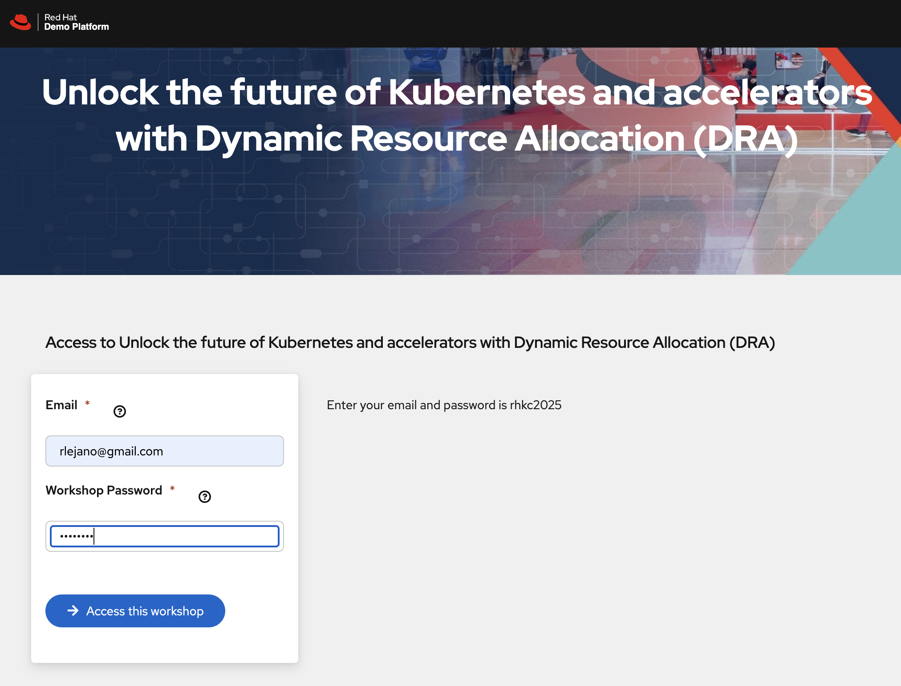

# Unlock the future of Kubernetes and accelerators with Dynamic Resource Allocation (DRA)

At the heart of the AI revolution are GPUs and the platform that provides access to them is Kubernetes. 
Workloads historically access GPUs and other devices with the device plugin API but features are lacking. 
The new Dynamic Resource Allocation (DRA) feature helps maximize GPU utilization across workloads with additional features like the ability to control device sharing across Pods, use multiple GPU models per node, handle dynamic allocation of multi-instance GPU (MIG) and more. DRA is not limited to GPUs but any specialized hardware that a Pod may use including network attached resources such as edge devices like IP cameras.
DRA is a new way to request for resources like GPUs and gives the ability to precisely control how resources are shared between Pods.
This tutorial introduces DRA, reviews the “behind-the-scenes” of DRA in the Kubernetes cluster and walks through multiple ways to use DRA to request for GPU and a network attached resource. 

In this tutorial we will install a Kubernetes cluster, review the DRA resources and how they work, install a sample DRA driver, run workloads that use the DRA driver.


[Module 1 - Introduction to Dynamic Resource Allocation](#module-1-introduction-to-dynamic-resource-allocation) 17 minutes
- [DRA Overview](#dra-overview) 7 minutes
- [Cluster Setup (kind on RHEL)](#cluster-setup) 10 minutes

[Module 2 - DRA Under the Covers](#module-2-dra-under-the-covers) 24 minutes
- [DRA Resource Driver](#dra-resource-driver) 6 minutes
- [DRA Resources](#dra-resources) 
  - [DRA Driver](#dra-driver-typically-a-daemonset) 5 minutes
  - [ResourceSlice](#resourceslice) 3 minutes
  - [DeviceClass](#deviceclass) 4 minutes
  - [ResourceClaim](#resourceclaim) 3 minutes
  - [ResourceClaimTemplate](#resourceclaimtemplate) 3 minutes

[Module 3 - DRA Drivers](#module-3-dra-drivers) 15 minutes
- [NVIDIA DRA Driver](#nvidia-dra-driver) 5 minutes
- [Intel DRA Driver](#intel-dra-driver) 5 minutes
- [DRANET](#dranet) 5 minutes

[Module 4 - Deploy DRA and Workloads](#module-4-deploying-dra-and-workloads) (17 minutes) 
- [Deploy a DeviceClass](#deploying-a-deviceclass)
- 6 minutes - Explore Workload YAML that uses DRA
6 minutes - Run Workload YAML that uses DRA
5 minutes - Confirm DRA uses

## Module 1: Introduction to Dynamic Resource Allocation
Kubernetes v1.34 was released in August and the core components of Dynamic Resource Allocation were promoted to stable / GA.
Workloads need more than CPU and memory but also need specialized hardware.
DRA is a new API for Pods to request and access specialized hardware like accelerators such as GPUs, field programmable gate arrays (FPGAs), Tensor Processing Unit (TPU) or network-attached devices.
Support for hardware are provided by vendors via DRA drivers.

The previous way of accessing specialized hardware was with node plugins and had limitations such as the inability to share allocated devices among multiple Pods and the device had to be attached to a node (node-local) not across the network fabric.

Node plugins are good for requesting single, linear quantity of resources.

Later, you will take a look at a few vendor's DRA drivers: NVIDIA and Intel
NVIDIA offers DRA driers for two types of resources: GPUs and ComputeDomains.

Compared to device plugins, DRA offers the following benefits:
- device filtering with Common Expression Language (CEL) for fine-grained filtering
- device sharing 
- centralized device categorization


### DRA Overview
Dynamic Resource Allocation 
Like with Device Plugin, you need a driver.
The DRA driver (installed locally) has a component called the kubelet-plugin (typically a DaemonSet) that talks to the node's kubelet about the device and prepares the device to be used.

The DRA driver publishes the available device in the form of a ResourceSlice object which is tied to the specific node where the DRA driver is installed -- so when a node goes down, the corresponding ResourceSlices will also be gone.

A DeviceClass is similar to a StorageClass. A DeviceClass has device configurations and parameters that are used as selectors. A DeviceClass corresponds to a device driver and is installed by the cluster admin or created by the DRA driver.

When a Pod wants to use a device, the user creates a ResourceClaim or uses a ResourceClaimTemplate that references a DeviceClass.

A cluster admin installs a corresponding DeviceClass that has device configuration and selectors for the device.

### Cluster Setup

Since DRA was GA'd in Kubernetes v1.34 released in August of 2025. You will use kind (Kubernetes in Docker) in this lab.

Go to the workshop platform to obtain login instructions to a VM:
<br><br>

<br><br>


SSH into your VM:\
Note: the following is an example, use the hostname provided to you in the above

```shell
ssh lab-user@rhel9.m4kkb.sandbox1943.opentlc.com
```

Accept to continue to connect if prompted and enter the provided password when prompted

```shell
The authenticity of host 'rhel9.m4kkb.sandbox1943.opentlc.com (3.22.88.9)' can't be established.
ED25519 key fingerprint is SHA256:1qrBdHzv0B3ExYHpdKBMcNOQwbpyzKyTB5Y4S3kjlfQ.
This key is not known by any other names.
Are you sure you want to continue connecting (yes/no/[fingerprint])? yes
Warning: Permanently added 'rhel9.m4kkb.sandbox1943.opentlc.com' (ED25519) to the list of known hosts.
lab-user@rhel9.m4kkb.sandbox1943.opentlc.com's password: 
```


There is a script that will install kind cluster with 1 control plane and 1 worker node cluster.

Run the install script:
Note: the install script will take about 3.5 minutes

``` shell
curl https://raw.githubusercontent.com/cloudnativeessentials/dra-tutorial/refs/heads/main/install-kind.sh | sh
```

Output:

```shell
This script installs Docker, kind, kubectl, and creates a kind cluster
This will take several minutes to complete 
Installing docker
Updating Subscription Management repositories.
Unable to read consumer identity
...

kubectl: OK
Creating cluster "kind" ...
 ✓ Ensuring node image (kindest/node:v1.34.0) 🖼 
 ✓ Preparing nodes 📦 📦  
 ✓ Writing configuration 📜 
 ✓ Starting control-plane 🕹️ 
 ✓ Installing CNI 🔌 
 ✓ Installing StorageClass 💾 
 ✓ Joining worker nodes 🚜 
Set kubectl context to "kind-kind"
You can now use your cluster with:

kubectl cluster-info --context kind-kind

Have a question, bug, or feature request? Let us know! https://kind.sigs.k8s.io/#community 🙂
  % Total    % Received % Xferd  Average Speed   Time    Time     Time  Current
                                 Dload  Upload   Total   Spent    Left  Speed
100 11928  100 11928    0     0  99400      0 --:--:-- --:--:-- --:--:-- 99400
Downloading https://get.helm.sh/helm-v3.19.0-linux-amd64.tar.gz
Verifying checksum... Done.
Preparing to install helm into /usr/local/bin
helm installed into /usr/local/bin/helm
kind cluster is ready
```

Test the cluster:
```shell
kubectl version
```

Output:
```shell
Client Version: v1.34.1
Kustomize Version: v5.7.1
Server Version: v1.34.0
```

Check the cluster's nodes:
```shell
kubectl get nodes
```

Output:
```shell
NAME                 STATUS   ROLES           AGE     VERSION
kind-control-plane   Ready    control-plane   2m27s   v1.34.0
kind-worker          Ready    <none>          2m14s   v1.34.0
```

DRA graduated to stable in v1.34 on August 27, 2025.
In v1.34, the core DRA APIs `resource.k8s.io/v1` graduated to stable from `resource.k8s.io/v1beta1`.


## Module 2: DRA Under the Covers

### DRA Resource Driver
2 components that coordinate with each other
- node-local kubelet plugin (DaemonSet) on nodes with the advertised device
- centralized controller runing in HA

Centralized Controller
- coordinates with Kubernetes scheduler to decide which node a ResourceClaim can be serviced on
- performs the actual Resource Claim allocation after a node is selected by the scheduler
- performs deallocation of ResourceClaim once deleted

Node-local kubelet plugin
- advetise node-local state that the centralize controller needs to help make allocation decisions
- makes node-local operations required to prepare a ReourceClaim (parameters may need to be setup) or deallocate a ResourceClaim on a node
- pass the device associated with prepared ResourceClaim to the kubelet which will then forward to the container runtime

2 Modes to communicate between Centralized Controller and kubelet-plugin
- Single, all-purpose, per-node CRD
  - kubelet plugin advertises available resources
  - Controller tracks resources allocated
  - kubelet-plugin tracks resources it prepared
- Split-purpose Communication
  - kubelet plugin advertises available resources via CRD that the controller can access
  - Controller tracks allocated resources through ResourceHandle in ResourceClaim
  - kubelet-plugin tracks resources in a checkpoint file on the local filesystem

Scheduling: in general, the Kubernetes scheduler and DRA driver controller communicate through the Kubernetes API server
by updating a `PodSchedulingContext` object which leads to the allocation of the ResourceClaim and Pod to a Node with the available resource.

Modes of Allocating Resources with DRA (specified in the ResourceClaim)
- Immediate
  - More restrictive, resource availability is not considered
  - Allocate resources immediately upon the creation of ResourceClaim
  - Pods are restricted to those nodes with ResourceClaim (other resource availability is not considered in scheduling)
- Delayed (wait for first consumer)
  - Resource availability is considered in part of overall Pod scheduling
  - Delays the allocation of the ResourceClaim until the first Pod that references it is scheduled

### DRA Resources

#### DRA Driver (typically a DaemonSet)
- typically installed as a DaemonSet and may use node affinity to schedule DaemonSets appropriately
e.g. feature.node.kubernetes.io/pci-10de.present=true or feature.node.kubernetes.io/cpu-model.vendor_id=NVIDIA  or nvidia.com/gpu.present=true

The DRA Driver has two main components:
dra-controller: manages resource allocation requests 
dra-kubelet-plugin: handles resource allocation on the node 

ResourceSlice: created by the DRA driver, tied to the node, represents devices represented by the driver on the node 

DeviceClass: defines category of devices e.g. gpu.nvidia.com

ResourceClaim: request for specific devices from a DeviceClass
Can be referenced by multiple Pods if the device can be shared and not tied to any Pod's lifecycle

ResourceClaimTemplate: template to generate resource claim. When a ResourceClaim is created from a ResourceClaimTemplate, it is tied to the Pod's lifecycle

#### ResourceSlice
Represents the available devices represented by a driver on the node.
The DRA driver creates the ResourceSlice.
The Kubernetes scheduler uses ResourceSlices to determine where to allocate Pods.

```shell
kubectl explain resourceslice
```

Output:
```shell
GROUP:      resource.k8s.io
KIND:       ResourceSlice
VERSION:    v1

DESCRIPTION:
    ResourceSlice represents one or more resources in a pool of similar
    resources, managed by a common driver. A pool may span more than one
    ResourceSlice, and exactly how many ResourceSlices comprise a pool is
    determined by the driver.
    
    At the moment, the only supported resources are devices with attributes and
    capacities. Each device in a given pool, regardless of how many
    ResourceSlices, must have a unique name. The ResourceSlice in which a device
    gets published may change over time. The unique identifier for a device is
    the tuple <driver name>, <pool name>, <device name>.
    
    Whenever a driver needs to update a pool, it increments the
    pool.Spec.Pool.Generation number and updates all ResourceSlices with that
    new number and new resource definitions. A consumer must only use
    ResourceSlices with the highest generation number and ignore all others.
    
    When allocating all resources in a pool matching certain criteria or when
    looking for the best solution among several different alternatives, a
    consumer should check the number of ResourceSlices in a pool (included in
    each ResourceSlice) to determine whether its view of a pool is complete and
    if not, should wait until the driver has completed updating the pool.
    
    For resources that are not local to a node, the node name is not set.
    Instead, the driver may use a node selector to specify where the devices are
    available.
    
    This is an alpha type and requires enabling the DynamicResourceAllocation
    feature gate.
    
FIELDS:
  apiVersion	<string>
    APIVersion defines the versioned schema of this representation of an object.
    Servers should convert recognized schemas to the latest internal value, and
    may reject unrecognized values. More info:
    https://git.k8s.io/community/contributors/devel/sig-architecture/api-conventions.md#resources

  kind	<string>
    Kind is a string value representing the REST resource this object
    represents. Servers may infer this from the endpoint the client submits
    requests to. Cannot be updated. In CamelCase. More info:
    https://git.k8s.io/community/contributors/devel/sig-architecture/api-conventions.md#types-kinds

  metadata	<ObjectMeta>
    Standard object metadata

  spec	<ResourceSliceSpec> -required-
    Contains the information published by the driver.
    
    Changing the spec automatically increments the metadata.generation number.

```
  

#### DeviceClass

The DeviceClass resource correspondes a resource driver with a named resource in the cluster.
Contains pre-defined selection criteria for certain devices and configuration for them.
Can include optional parameters like a GPUClaimParameters that we'll look at later.

Each request to allocate a device in a ResourceClaim must reference exactly one DeviceClass.
A DeviceClas defines a category of devices.
The DeviceClass may be installed with the driver.

```shell
kubectl explain deviceclass
```

Output:
```shell
GROUP:      resource.k8s.io
KIND:       DeviceClass
VERSION:    v1

DESCRIPTION:
    DeviceClass is a vendor- or admin-provided resource that contains device
    configuration and selectors. It can be referenced in the device requests of
    a claim to apply these presets. Cluster scoped.
    
    This is an alpha type and requires enabling the DynamicResourceAllocation
    feature gate.
    
FIELDS:
  apiVersion	<string>
    APIVersion defines the versioned schema of this representation of an object.
    Servers should convert recognized schemas to the latest internal value, and
    may reject unrecognized values. More info:
    https://git.k8s.io/community/contributors/devel/sig-architecture/api-conventions.md#resources

  kind	<string>
    Kind is a string value representing the REST resource this object
    represents. Servers may infer this from the endpoint the client submits
    requests to. Cannot be updated. In CamelCase. More info:
    https://git.k8s.io/community/contributors/devel/sig-architecture/api-conventions.md#types-kinds

  metadata	<ObjectMeta>
    Standard object metadata

  spec	<DeviceClassSpec> -required-
    Spec defines what can be allocated and how to configure it.
    
    This is mutable. Consumers have to be prepared for classes changing at any
    time, either because they get updated or replaced. Claim allocations are
    done once based on whatever was set in classes at the time of allocation.
    
    Changing the spec automatically increments the metadata.generation number.
```

A DeviceClass template is:
```yaml
apiversion: resource.k8s.io/v1alpha3
kind: DeviceClass
metadata:
  name: gpu.vendor.com
spec:
  selectors:
  - cel:
      expression: "device.driver == 'gpu.vendor.com'"
```

#### ResourceClaim
Describes a request for access to resources in the cluster, for use by workloads. 
For example, if a workload needs an accelerator device with specific properties, this is how that request is expressed. 
The `status` stanza tracks whether this claim has been satisfied and what specific resources have been allocated.
A ResourceClaim is a claim to use a specific DeviceClass and represents an acual resource allocation made by the resource driver.
Users create ResourceClaims and reger to the DeviceClass they want to allocate resources for. The Pod can then use these resources with a ResourceClaim.

```shell
kubectl explain resourceclaim
```

Output:
```shell
GROUP:      resource.k8s.io
KIND:       ResourceClaim
VERSION:    v1

DESCRIPTION:
    ResourceClaim describes a request for access to resources in the cluster,
    for use by workloads. For example, if a workload needs an accelerator device
    with specific properties, this is how that request is expressed. The status
    stanza tracks whether this claim has been satisfied and what specific
    resources have been allocated.
    
    This is an alpha type and requires enabling the DynamicResourceAllocation
    feature gate.
    
FIELDS:
  apiVersion	<string>
    APIVersion defines the versioned schema of this representation of an object.
    Servers should convert recognized schemas to the latest internal value, and
    may reject unrecognized values. More info:
    https://git.k8s.io/community/contributors/devel/sig-architecture/api-conventions.md#resources

  kind	<string>
    Kind is a string value representing the REST resource this object
    represents. Servers may infer this from the endpoint the client submits
    requests to. Cannot be updated. In CamelCase. More info:
    https://git.k8s.io/community/contributors/devel/sig-architecture/api-conventions.md#types-kinds

  metadata	<ObjectMeta>
    Standard object metadata

  spec	<ResourceClaimSpec> -required-
    Spec describes what is being requested and how to configure it. The spec is
    immutable.

  status	<ResourceClaimStatus>
    Status describes whether the claim is ready to use and what has been
    allocated.
```


ResourceClaims can be created manually by users or by Kubernetes from a ResourceClaimTemplate.
If a ResourceClaimTemplate is used then the ResourceClaim is tied to a specific Pod and tied to the Pod's lifecycle.
If a ResourceClaim is to be shared among multiple Pods or if the ResourceClaim is to be independent of a Pod's lifecycle then manually create the Resource Claim.

Sample ResourceClaim:
```yaml
apiVersion: resource.k8s.io/v1
kind: ResourceClaim
metadata:
  name: shared-gpu-resourceclaim
spec:
  devices:
    requests:
    - name: single-gpu-claim
      exactly:
        deviceClassName: gpu.vendor.com
        allocationMode: All
        selectors:
        - cel:
            expression: |-
              device.attributes["driver.example.com"].type == "gpu" &&
              device.capacity["driver.example.com"].memory == quantity("64Gi")             
```

#### ResourceClaimTemplate


## Module 3: DRA Drivers

### NVIDIA DRA Driver
The NVIDIA DRA Driver is installed via a helm chart
Add the NVDIA helm repository

```shell
helm repo add nvidia https://helm.ngc.nvidia.com/nvidia && helm repo update
```

Output:
```shell
"nvidia" has been added to your repositories
Hang tight while we grab the latest from your chart repositories...
...Successfully got an update from the "nvidia" chart repository
Update Complete. ⎈Happy Helming!⎈

```

Let's confirm the chart:
```shell
helm show chart nvidia/nvidia-dra-driver-gpu
```

Output:
```shell
apiVersion: v2
appVersion: 25.8.0
description: Official Helm chart for the NVIDIA DRA Driver for GPUs
kubeVersion: '>=1.32.0-0'
name: nvidia-dra-driver-gpu
type: application
version: 25.8.0
```

Let's look at the install confirmation parameters:
```shell
helm show values nvidia/nvidia-dra-driver-gpu
```

Output:
```shell
# Copyright 2023 NVIDIA CORPORATION
#
# Licensed under the Apache License, Version 2.0 (the "License");
# you may not use this file except in compliance with the License.
# You may obtain a copy of the License at
#
#     http://www.apache.org/licenses/LICENSE-2.0
#
# Unless required by applicable law or agreed to in writing, software
# distributed under the License is distributed on an "AS IS" BASIS,
# WITHOUT WARRANTIES OR CONDITIONS OF ANY KIND, either express or implied.
# See the License for the specific language governing permissions and
# limitations under the License.

# Default values for k8s-dra-driver-gpu.
# This is a YAML-formatted file.
# Declare variables to be passed into your templates.

# Specify the driver root on the host.
# If the NVIDIA GPU driver is managed using the NVIDIA GPU Driver Container,
# this is typically /run/nvidia/driver.
# For driver installed directly on a host, a value of `/` is used.
nvidiaDriverRoot: /

# Optional path to the nvidia-cdi-hook executable.
# If not specified, the default path inferred from the nvidia-container-toolkit library version will be used.
nvidiaCDIHookPath: ""

nameOverride: ""
fullnameOverride: ""
namespaceOverride: ""
selectorLabelsOverride: {}
gpuResourcesEnabledOverride: false

allowDefaultNamespace: false

imagePullSecrets: []
image:
  repository: nvcr.io/nvidia/k8s-dra-driver-gpu
  pullPolicy: IfNotPresent
  # Note: an empty string is translated to the `appVersion` string from
  # the Helm chart YAML (effectively implementing the default value to be
  # the current version). Also note that a "v" is prefixed to the
  # `appVersion` value.
  tag: ""

serviceAccount:
  # Specifies whether a service account should be created
  create: true
  # Annotations to add to the service account
  annotations: {}
  # The name of the service account to use.
  # If not set and create is true, a name is generated using the fullname template
  name: ""

resources:
  gpus:
    enabled: true
  computeDomains:
    enabled: true

# Feature gates configuration following Kubernetes patterns
# Configure feature gates as key-value pairs (feature_name: true/false)
# Examples:
# featureGates:
#   ExampleFeature: false              # Project-specific alpha feature
#   ContextualLogging: true            # Kubernetes logging feature (enabled by default)
#   LoggingAlphaOptions: false         # Kubernetes logging alpha features
#   LoggingBetaOptions: true           # Kubernetes logging beta features
featureGates: {}

# Log verbosity for all components. Zero or greater, higher number means higher
# verbosity. Regardless of this setting, messages of type Error, Warning, and
# Info(level 0) are always logged. Can also be set for individual components via
# environment variable (that takes precedence), see
# https://github.com/NVIDIA/k8s-dra-driver-gpu/wiki/Troubleshooting#controlling-log-verbosity
#
# An (incomplete) representation of which types of messages to expect with
# increasing verbosity level:
#
# Level 0:
# - Configuration detail (during process startup)
# - Kubelet plugins:
#   - Permanent errors during device Prepare() and Unprepare()
#
# Level 1:
# - CD controller:
#   - Confirm cleanup of stale objects
# - k8s client-go: feature gates
# - Kubelet plugins:
#   - Device (un)prepare confirmation, with resource claim UID
#   - Workqueue reconciliation failures (noisy: mainly expected, retryable
#     errors)
# - CD daemon:
#   - explicit 'wait for nodes update'
#
# Level 2:
# - reflector.go informer state: "Caches populated"
# - Kubelet plugins:
#   - Acknowledge when Unprepare is a noop
# - CD controller:
#   - Added/updated API object callback confirmation
#
# Level 3:
# - reflector.go informer state: "Listing and watching"
#
# Level 6:
# - round_trippers.go output (API server request/response detail)
# - Kubelet plugins:
#   - GRPC request/response detail
#   - Checkpoint file update confirmation
# - CD daemon:
#   - explicit 'IP set did not change'
#
# Level 7:
# - Kubelet plugins:
#   - Health check
logVerbosity: "4"

# Webhook configuration
webhook:
  enabled: false
  replicas: 1
  servicePort: 443
  containerPort: 443
  priorityClassName: "system-cluster-critical"
  strategy:
    type: RollingUpdate
    rollingUpdate:
      maxUnavailable: "100%"
  podAnnotations: {}
  podSecurityContext: {}
  nodeSelector: {}
  tolerations: []
  affinity: {}
  containers:
    webhook:
      securityContext:
        privileged: false
      resources: {}
  serviceAccount:
    # Specifies whether a service account should be created
    create: true
    # Annotations to add to the service account
    name: ""
  # failurePolicy defines how the API server should handle requests if the webhook call fails.
  # Options:
  #   - Fail   : reject the request if the webhook call fails either due to cert errors, timeout or if the service is unreachable.
  #   - Ignore : allow the request to continue if the webhook call fails.
  failurePolicy: Fail
  # TLS certificate configuration
  tls:
    # Certificate management mode: "cert-manager" or "secret"
    # - "cert-manager": Use cert-manager to automatically generate and manage certificates
    # - "secret": Use a user-provided secret containing tls.crt and tls.key
    mode: "cert-manager"
    certManager:
      # Issuer type: "selfsigned", "clusterissuer", or "issuer"
      issuerType: "selfsigned"
      # Issuer name (required when issuerType is "clusterissuer" or "issuer")
      issuerName: ""
      # Additional DNS names for the certificate
      dnsNames: []
    secret:
      # Name of the secret containing tls.crt and tls.key
      name: ""
      # Base64-encoded CA certificate bundle for validating the webhook's TLS certificate (base64 encoded)
      # Required when using secret mode.
      # Note: Only include intermediate CA certificates, not root CA certificates
      caBundle: ""

controller:
  priorityClassName: "system-node-critical"
  podAnnotations: {}
  podSecurityContext: {}
  nodeSelector: {}
  tolerations:
  - key: node-role.kubernetes.io/control-plane
    operator: Exists
    effect: NoSchedule
  containers:
    computeDomain:
      securityContext: {}
      env: []
      resources: {}
  affinity:
    nodeAffinity:
      requiredDuringSchedulingIgnoredDuringExecution:
        nodeSelectorTerms:
        - matchExpressions:
          - key: "node-role.kubernetes.io/control-plane"
            operator: "Exists"

kubeletPlugin:
  priorityClassName: "system-node-critical"
  updateStrategy:
    type: RollingUpdate
    rollingUpdate:
      maxUnavailable: "100%"
  podAnnotations: {}
  podSecurityContext: {}
  nodeSelector: {}
  tolerations: []
  kubeletRegistrarDirectoryPath: /var/lib/kubelet/plugins_registry
  kubeletPluginsDirectoryPath: /var/lib/kubelet/plugins
  containers:
    init:
      securityContext: {}
      resources: {}
    computeDomains:
      env: []
      securityContext:
        privileged: true
      resources: {}
      # Port running a gRPC health service checked by a livenessProbe.
      # Set to a negative value to disable the service and the probe.
      healthcheckPort: 51515
    gpus:
      env: []
      securityContext:
        privileged: true
      resources: {}
      # Port running a gRPC health service checked by a livenessProbe.
      # Set to a negative value to disable the service and the probe.
      healthcheckPort: 51516
  affinity:
    nodeAffinity:
      requiredDuringSchedulingIgnoredDuringExecution:
        nodeSelectorTerms:
        - matchExpressions:
          # On discrete-GPU based systems NFD adds the following label where 10de is the NVIDIA PCI vendor ID
          - key: feature.node.kubernetes.io/pci-10de.present
            operator: In
            values:
            - "true"
        - matchExpressions:
          # On some Tegra-based systems NFD detects the CPU vendor ID as NVIDIA
          - key: feature.node.kubernetes.io/cpu-model.vendor_id
            operator: In
            values:
            - "NVIDIA"
        - matchExpressions:
          # We allow a GPU deployment to be forced by setting the following label to "true"
          - key: "nvidia.com/gpu.present"
            operator: In
            values:
            - "true"
```

Let's look at all the information from the chart:

```shell
helm show all nvidia/nvidia-dra-driver-gpu
```

Output:
```shell
apiVersion: v2
appVersion: 25.8.0
description: Official Helm chart for the NVIDIA DRA Driver for GPUs
kubeVersion: '>=1.32.0-0'
name: nvidia-dra-driver-gpu
type: application
version: 25.8.0

---
# Copyright 2023 NVIDIA CORPORATION
#
# Licensed under the Apache License, Version 2.0 (the "License");
# you may not use this file except in compliance with the License.
# You may obtain a copy of the License at
#
#     http://www.apache.org/licenses/LICENSE-2.0
#
# Unless required by applicable law or agreed to in writing, software
# distributed under the License is distributed on an "AS IS" BASIS,
# WITHOUT WARRANTIES OR CONDITIONS OF ANY KIND, either express or implied.
# See the License for the specific language governing permissions and
# limitations under the License.

# Default values for k8s-dra-driver-gpu.
# This is a YAML-formatted file.
# Declare variables to be passed into your templates.

# Specify the driver root on the host.
# If the NVIDIA GPU driver is managed using the NVIDIA GPU Driver Container,
# this is typically /run/nvidia/driver.
# For driver installed directly on a host, a value of `/` is used.
nvidiaDriverRoot: /

# Optional path to the nvidia-cdi-hook executable.
# If not specified, the default path inferred from the nvidia-container-toolkit library version will be used.
nvidiaCDIHookPath: ""

nameOverride: ""
fullnameOverride: ""
namespaceOverride: ""
selectorLabelsOverride: {}
gpuResourcesEnabledOverride: false

allowDefaultNamespace: false

imagePullSecrets: []
image:
  repository: nvcr.io/nvidia/k8s-dra-driver-gpu
  pullPolicy: IfNotPresent
  # Note: an empty string is translated to the `appVersion` string from
  # the Helm chart YAML (effectively implementing the default value to be
  # the current version). Also note that a "v" is prefixed to the
  # `appVersion` value.
  tag: ""

serviceAccount:
  # Specifies whether a service account should be created
  create: true
  # Annotations to add to the service account
  annotations: {}
  # The name of the service account to use.
  # If not set and create is true, a name is generated using the fullname template
  name: ""

resources:
  gpus:
    enabled: true
  computeDomains:
    enabled: true

# Feature gates configuration following Kubernetes patterns
# Configure feature gates as key-value pairs (feature_name: true/false)
# Examples:
# featureGates:
#   ExampleFeature: false              # Project-specific alpha feature
#   ContextualLogging: true            # Kubernetes logging feature (enabled by default)
#   LoggingAlphaOptions: false         # Kubernetes logging alpha features
#   LoggingBetaOptions: true           # Kubernetes logging beta features
featureGates: {}

# Log verbosity for all components. Zero or greater, higher number means higher
# verbosity. Regardless of this setting, messages of type Error, Warning, and
# Info(level 0) are always logged. Can also be set for individual components via
# environment variable (that takes precedence), see
# https://github.com/NVIDIA/k8s-dra-driver-gpu/wiki/Troubleshooting#controlling-log-verbosity
#
# An (incomplete) representation of which types of messages to expect with
# increasing verbosity level:
#
# Level 0:
# - Configuration detail (during process startup)
# - Kubelet plugins:
#   - Permanent errors during device Prepare() and Unprepare()
#
# Level 1:
# - CD controller:
#   - Confirm cleanup of stale objects
# - k8s client-go: feature gates
# - Kubelet plugins:
#   - Device (un)prepare confirmation, with resource claim UID
#   - Workqueue reconciliation failures (noisy: mainly expected, retryable
#     errors)
# - CD daemon:
#   - explicit 'wait for nodes update'
#
# Level 2:
# - reflector.go informer state: "Caches populated"
# - Kubelet plugins:
#   - Acknowledge when Unprepare is a noop
# - CD controller:
#   - Added/updated API object callback confirmation
#
# Level 3:
# - reflector.go informer state: "Listing and watching"
#
# Level 6:
# - round_trippers.go output (API server request/response detail)
# - Kubelet plugins:
#   - GRPC request/response detail
#   - Checkpoint file update confirmation
# - CD daemon:
#   - explicit 'IP set did not change'
#
# Level 7:
# - Kubelet plugins:
#   - Health check
logVerbosity: "4"

# Webhook configuration
webhook:
  enabled: false
  replicas: 1
  servicePort: 443
  containerPort: 443
  priorityClassName: "system-cluster-critical"
  strategy:
    type: RollingUpdate
    rollingUpdate:
      maxUnavailable: "100%"
  podAnnotations: {}
  podSecurityContext: {}
  nodeSelector: {}
  tolerations: []
  affinity: {}
  containers:
    webhook:
      securityContext:
        privileged: false
      resources: {}
  serviceAccount:
    # Specifies whether a service account should be created
    create: true
    # Annotations to add to the service account
    name: ""
  # failurePolicy defines how the API server should handle requests if the webhook call fails.
  # Options:
  #   - Fail   : reject the request if the webhook call fails either due to cert errors, timeout or if the service is unreachable.
  #   - Ignore : allow the request to continue if the webhook call fails.
  failurePolicy: Fail
  # TLS certificate configuration
  tls:
    # Certificate management mode: "cert-manager" or "secret"
    # - "cert-manager": Use cert-manager to automatically generate and manage certificates
    # - "secret": Use a user-provided secret containing tls.crt and tls.key
    mode: "cert-manager"
    certManager:
      # Issuer type: "selfsigned", "clusterissuer", or "issuer"
      issuerType: "selfsigned"
      # Issuer name (required when issuerType is "clusterissuer" or "issuer")
      issuerName: ""
      # Additional DNS names for the certificate
      dnsNames: []
    secret:
      # Name of the secret containing tls.crt and tls.key
      name: ""
      # Base64-encoded CA certificate bundle for validating the webhook's TLS certificate (base64 encoded)
      # Required when using secret mode.
      # Note: Only include intermediate CA certificates, not root CA certificates
      caBundle: ""

controller:
  priorityClassName: "system-node-critical"
  podAnnotations: {}
  podSecurityContext: {}
  nodeSelector: {}
  tolerations:
  - key: node-role.kubernetes.io/control-plane
    operator: Exists
    effect: NoSchedule
  containers:
    computeDomain:
      securityContext: {}
      env: []
      resources: {}
  affinity:
    nodeAffinity:
      requiredDuringSchedulingIgnoredDuringExecution:
        nodeSelectorTerms:
        - matchExpressions:
          - key: "node-role.kubernetes.io/control-plane"
            operator: "Exists"

kubeletPlugin:
  priorityClassName: "system-node-critical"
  updateStrategy:
    type: RollingUpdate
    rollingUpdate:
      maxUnavailable: "100%"
  podAnnotations: {}
  podSecurityContext: {}
  nodeSelector: {}
  tolerations: []
  kubeletRegistrarDirectoryPath: /var/lib/kubelet/plugins_registry
  kubeletPluginsDirectoryPath: /var/lib/kubelet/plugins
  containers:
    init:
      securityContext: {}
      resources: {}
    computeDomains:
      env: []
      securityContext:
        privileged: true
      resources: {}
      # Port running a gRPC health service checked by a livenessProbe.
      # Set to a negative value to disable the service and the probe.
      healthcheckPort: 51515
    gpus:
      env: []
      securityContext:
        privileged: true
      resources: {}
      # Port running a gRPC health service checked by a livenessProbe.
      # Set to a negative value to disable the service and the probe.
      healthcheckPort: 51516
  affinity:
    nodeAffinity:
      requiredDuringSchedulingIgnoredDuringExecution:
        nodeSelectorTerms:
        - matchExpressions:
          # On discrete-GPU based systems NFD adds the following label where 10de is the NVIDIA PCI vendor ID
          - key: feature.node.kubernetes.io/pci-10de.present
            operator: In
            values:
            - "true"
        - matchExpressions:
          # On some Tegra-based systems NFD detects the CPU vendor ID as NVIDIA
          - key: feature.node.kubernetes.io/cpu-model.vendor_id
            operator: In
            values:
            - "NVIDIA"
        - matchExpressions:
          # We allow a GPU deployment to be forced by setting the following label to "true"
          - key: "nvidia.com/gpu.present"
            operator: In
            values:
            - "true"

---
apiVersion: apiextensions.k8s.io/v1
kind: CustomResourceDefinition
metadata:
  annotations:
    controller-gen.kubebuilder.io/version: v0.17.1
  name: computedomains.resource.nvidia.com
spec:
  group: resource.nvidia.com
  names:
    kind: ComputeDomain
    listKind: ComputeDomainList
    plural: computedomains
    singular: computedomain
  scope: Namespaced
  versions:
  - name: v1beta1
    schema:
      openAPIV3Schema:
        description: ComputeDomain prepares a set of nodes to run a multi-node workload
          in.
        properties:
          apiVersion:
            description: |-
              APIVersion defines the versioned schema of this representation of an object.
              Servers should convert recognized schemas to the latest internal value, and
              may reject unrecognized values.
              More info: https://git.k8s.io/community/contributors/devel/sig-architecture/api-conventions.md#resources
            type: string
          kind:
            description: |-
              Kind is a string value representing the REST resource this object represents.
              Servers may infer this from the endpoint the client submits requests to.
              Cannot be updated.
              In CamelCase.
              More info: https://git.k8s.io/community/contributors/devel/sig-architecture/api-conventions.md#types-kinds
            type: string
          metadata:
            type: object
          spec:
            description: ComputeDomainSpec provides the spec for a ComputeDomain.
            properties:
              channel:
                description: ComputeDomainChannelSpec provides the spec for a channel
                  used to run a workload inside a ComputeDomain.
                properties:
                  allocationMode:
                    default: Single
                    description: |-
                      Allows for requesting all IMEX channels (the maximum per IMEX domain) or
                      precisely one.
                    enum:
                    - All
                    - Single
                    type: string
                  resourceClaimTemplate:
                    description: ComputeDomainResourceClaimTemplate provides the details
                      of the ResourceClaimTemplate to generate.
                    properties:
                      name:
                        type: string
                    required:
                    - name
                    type: object
                required:
                - resourceClaimTemplate
                type: object
              numNodes:
                description: |-
                  Intended number of IMEX daemons (i.e., individual compute nodes) in the
                  ComputeDomain. Must be zero or greater.

                  With `featureGates.IMEXDaemonsWithDNSNames=true` (the default), this is
                  recommended to be set to zero. Workload must implement and consult its
                  own source of truth for the number of workers online before trying to
                  share GPU memory (and hence triggering IMEX interaction). When non-zero,
                  `numNodes` is used only for automatically updating the global
                  ComputeDomain `Status` (indicating `Ready` when the number of ready IMEX
                  daemons equals `numNodes`). In this mode, a `numNodes` value greater than
                  zero in particular does not gate the startup of IMEX daemons: individual
                  IMEX daemons are started immediately without waiting for its peers, and
                  any workload pod gets released right after its local IMEX daemon has
                  started.

                  With `featureGates.IMEXDaemonsWithDNSNames=false`, `numNodes` must be set
                  to the expected number of worker nodes joining the ComputeDomain. In that
                  mode, all workload pods are held back (with containers in state
                  `ContainerCreating`) until the underlying IMEX domain has been joined by
                  `numNodes` IMEX daemons. Pods from more than `numNodes` nodes trying to
                  join the ComputeDomain may lead to unexpected behavior.

                  The `numNodes` parameter is deprecated and will be removed in the next
                  API version.
                type: integer
            required:
            - channel
            - numNodes
            type: object
            x-kubernetes-validations:
            - message: A computeDomain.spec is immutable
              rule: self == oldSelf
          status:
            description: |-
              Global ComputeDomain status. Can be used to guide debugging efforts.
              Workload however should not rely on inspecting this field at any point
              during its lifecycle.
            properties:
              nodes:
                items:
                  description: ComputeDomainNode provides information about each node
                    added to a ComputeDomain.
                  properties:
                    cliqueID:
                      type: string
                    index:
                      description: |-
                        The Index field is used to ensure a consistent IP-to-DNS name
                        mapping across all machines within an IMEX domain. Each node's index
                        directly determines its DNS name within a given NVLink partition
                        (i.e. clique). In other words, the 2-tuple of (CliqueID, Index) will
                        always be unique. This field is marked as optional (but not
                        omitempty) in order to support downgrades and avoid an API bump.
                      type: integer
                    ipAddress:
                      type: string
                    name:
                      type: string
                    status:
                      default: NotReady
                      description: |-
                        The Status field tracks the readiness of the IMEX daemon running on
                        this node. It gets switched to Ready whenever the IMEX daemon is
                        ready to broker GPU memory exchanges and switches to NotReady when
                        it is not. It is marked as optional in order to support downgrades
                        and avoid an API bump.
                      enum:
                      - Ready
                      - NotReady
                      type: string
                  required:
                  - cliqueID
                  - ipAddress
                  - name
                  type: object
                type: array
                x-kubernetes-list-map-keys:
                - name
                x-kubernetes-list-type: map
              status:
                default: NotReady
                enum:
                - Ready
                - NotReady
                type: string
            required:
            - status
            type: object
        type: object
    served: true
    storage: true
    subresources:
      status: {}

```

As we reviewed, the DRA driver is made up of 2 components: controller and a kubelet plugin.
Let's take a look at the NVIDIA DRA driver's controller:

```shell
helm show all nvidia/nvidia-dra-driver-gpu | grep -A 21 "controller:" 
```

Output:
```shell
# - CD controller:
#   - Confirm cleanup of stale objects
# - k8s client-go: feature gates
# - Kubelet plugins:
#   - Device (un)prepare confirmation, with resource claim UID
#   - Workqueue reconciliation failures (noisy: mainly expected, retryable
#     errors)
# - CD daemon:
#   - explicit 'wait for nodes update'
#
# Level 2:
# - reflector.go informer state: "Caches populated"
# - Kubelet plugins:
#   - Acknowledge when Unprepare is a noop
# - CD controller:
#   - Added/updated API object callback confirmation
#
# Level 3:
# - reflector.go informer state: "Listing and watching"
#
# Level 6:
# - round_trippers.go output (API server request/response detail)
# - Kubelet plugins:
#   - GRPC request/response detail
#   - Checkpoint file update confirmation
# - CD daemon:
#   - explicit 'IP set did not change'
#
# Level 7:
# - Kubelet plugins:
#   - Health check
logVerbosity: "4"

# Webhook configuration
webhook:
  enabled: false
--
controller:
  priorityClassName: "system-node-critical"
  podAnnotations: {}
  podSecurityContext: {}
  nodeSelector: {}
  tolerations:
  - key: node-role.kubernetes.io/control-plane
    operator: Exists
    effect: NoSchedule
  containers:
    computeDomain:
      securityContext: {}
      env: []
      resources: {}
  affinity:
    nodeAffinity:
      requiredDuringSchedulingIgnoredDuringExecution:
        nodeSelectorTerms:
        - matchExpressions:
          - key: "node-role.kubernetes.io/control-plane"
            operator: "Exists"
```

Now let's take a lok at the NVIDIA DRA driver's kubelet plugin:

```shell
helm show all nvidia/nvidia-dra-driver-gpu | grep -A 19 "kubeletPlugin:" 
```

Output:
```shell
kubeletPlugin:
  priorityClassName: "system-node-critical"
  updateStrategy:
    type: RollingUpdate
    rollingUpdate:
      maxUnavailable: "100%"
  podAnnotations: {}
  podSecurityContext: {}
  nodeSelector: {}
  tolerations: []
  kubeletRegistrarDirectoryPath: /var/lib/kubelet/plugins_registry
  kubeletPluginsDirectoryPath: /var/lib/kubelet/plugins
  containers:
    init:
      securityContext: {}
      resources: {}
    computeDomains:
      env: []
      securityContext:
        privileged: true
```

To install the NVIDIA DRA driver, we would do a `helm install`. 
Let's do a dry-run to simulate the Helm chart install:

```shell
helm install --dry-run nvidia-dra-driver-gpu nvidia/nvidia-dra-driver-gpu \
    --create-namespace \
    --namespace nvidia-dra-driver-gpu \
    --set resources.gpus.enabled=false \
    --set nvidiaDriverRoot=/run/nvidia/driver
```
The command above uses an operator-provided GPU driver, for host-provided GPU drivers use the `--set resources.gpus.enabled=false` option

Output:
```shell
NAME: nvidia-dra-driver-gpu
LAST DEPLOYED: Tue Nov  4 04:05:56 2025
NAMESPACE: nvidia-dra-driver-gpu
STATUS: pending-install
REVISION: 1
TEST SUITE: None
HOOKS:
MANIFEST:
---
# Source: nvidia-dra-driver-gpu/templates/rbac-compute-domain-daemon.yaml
apiVersion: v1
kind: ServiceAccount
metadata:
  name: compute-domain-daemon-service-account
  namespace: nvidia-dra-driver-gpu
---
# Source: nvidia-dra-driver-gpu/templates/rbac-controller.yaml
apiVersion: v1
kind: ServiceAccount
metadata:
  name: nvidia-dra-driver-gpu-service-account-controller
  namespace: nvidia-dra-driver-gpu
  labels:
    helm.sh/chart: nvidia-dra-driver-gpu-25.8.0
    app.kubernetes.io/version: "25.8.0"
    app.kubernetes.io/managed-by: Helm
    app.kubernetes.io/name: nvidia-dra-driver-gpu
    app.kubernetes.io/instance: nvidia-dra-driver-gpu
---
# Source: nvidia-dra-driver-gpu/templates/rbac-kubeletplugin.yaml
apiVersion: v1
kind: ServiceAccount
metadata:
  name: nvidia-dra-driver-gpu-service-account-kubeletplugin
  namespace: nvidia-dra-driver-gpu
  labels:
    helm.sh/chart: nvidia-dra-driver-gpu-25.8.0
    app.kubernetes.io/version: "25.8.0"
    app.kubernetes.io/managed-by: Helm
    app.kubernetes.io/name: nvidia-dra-driver-gpu
    app.kubernetes.io/instance: nvidia-dra-driver-gpu
---
# Source: nvidia-dra-driver-gpu/templates/rbac-compute-domain-daemon.yaml
apiVersion: rbac.authorization.k8s.io/v1
kind: ClusterRole
metadata:
  name: compute-domain-daemon-role
rules:
- apiGroups: ["resource.nvidia.com"]
  resources: ["computedomains", "computedomains/status"]
  verbs: ["get", "list", "watch", "update", "patch"]
- apiGroups: [""]
  resources: ["pods"]
  verbs: ["get", "list", "watch"]
---
# Source: nvidia-dra-driver-gpu/templates/rbac-controller.yaml
apiVersion: rbac.authorization.k8s.io/v1
kind: ClusterRole
metadata:
  name: nvidia-dra-driver-gpu-clusterrole-controller
rules:
- apiGroups: ["resource.nvidia.com"]
  resources: ["computedomains"]
  verbs: ["get", "list", "watch", "update"]
- apiGroups: ["resource.nvidia.com"]
  resources: ["computedomains/status"]
  verbs: ["update"]
- apiGroups: ["resource.k8s.io"]
  resources: ["resourceclaimtemplates"]
  verbs: ["get", "list", "watch", "create", "update", "delete"]
- apiGroups: [""]
  resources: ["nodes"]
  verbs: ["get", "list", "watch", "update"]
- apiGroups: [""]
  resources: ["pods"]
  verbs: ["get", "list", "watch"]
---
# Source: nvidia-dra-driver-gpu/templates/rbac-kubeletplugin.yaml
apiVersion: rbac.authorization.k8s.io/v1
kind: ClusterRole
metadata:
  name: nvidia-dra-driver-gpu-clusterrole-kubeletplugin
rules:
- apiGroups: ["resource.nvidia.com"]
  resources: ["computedomains"]
  verbs: ["get", "list", "watch"]
- apiGroups: ["resource.k8s.io"]
  resources: ["resourceclaims"]
  verbs: ["get", "list", "watch"]
- apiGroups: ["resource.k8s.io"]
  resources: ["resourceslices"]
  verbs: ["get", "list", "watch", "create", "update", "delete"]
- apiGroups: [""]
  resources: ["nodes"]
  verbs: ["get", "list", "watch", "update"]
- apiGroups: [""]
  resources: ["pods"]
  verbs: ["get", "list", "watch"]
---
# Source: nvidia-dra-driver-gpu/templates/rbac-compute-domain-daemon.yaml
apiVersion: rbac.authorization.k8s.io/v1
kind: ClusterRoleBinding
metadata:
  name: compute-domain-daemon-role-binding-nvidia-dra-driver-gpu
subjects:
- kind: ServiceAccount
  name: compute-domain-daemon-service-account
  namespace: nvidia-dra-driver-gpu
roleRef:
  kind: ClusterRole
  name: compute-domain-daemon-role
  apiGroup: rbac.authorization.k8s.io
---
# Source: nvidia-dra-driver-gpu/templates/rbac-controller.yaml
apiVersion: rbac.authorization.k8s.io/v1
kind: ClusterRoleBinding
metadata:
  name: nvidia-dra-driver-gpu-clusterrole-binding-controller-nvidia-dra-driver-gpu
subjects:
  - kind: ServiceAccount
    name: nvidia-dra-driver-gpu-service-account-controller
    namespace: nvidia-dra-driver-gpu
roleRef:
  kind: ClusterRole
  name: nvidia-dra-driver-gpu-clusterrole-controller
  apiGroup: rbac.authorization.k8s.io
---
# Source: nvidia-dra-driver-gpu/templates/rbac-kubeletplugin.yaml
apiVersion: rbac.authorization.k8s.io/v1
kind: ClusterRoleBinding
metadata:
  name: nvidia-dra-driver-gpu-clusterrole-binding-kubeletplugin-nvidia-dra-driver-gpu
subjects:
  - kind: ServiceAccount
    name: nvidia-dra-driver-gpu-service-account-kubeletplugin
    namespace: nvidia-dra-driver-gpu
roleRef:
  kind: ClusterRole
  name: nvidia-dra-driver-gpu-clusterrole-kubeletplugin
  apiGroup: rbac.authorization.k8s.io
---
# Source: nvidia-dra-driver-gpu/templates/rbac-controller.yaml
apiVersion: rbac.authorization.k8s.io/v1
kind: Role
metadata:
  name: nvidia-dra-driver-gpu-role-controller
  namespace: nvidia-dra-driver-gpu
rules:
- apiGroups: ["apps"]
  resources: ["daemonsets"]
  verbs: ["get", "list", "watch", "create", "update", "patch", "delete"]
---
# Source: nvidia-dra-driver-gpu/templates/rbac-kubeletplugin.yaml
apiVersion: rbac.authorization.k8s.io/v1
kind: Role
metadata:
  name: nvidia-dra-driver-gpu-role-kubeletplugin
  namespace: nvidia-dra-driver-gpu
rules:
---
# Source: nvidia-dra-driver-gpu/templates/rbac-controller.yaml
apiVersion: rbac.authorization.k8s.io/v1
kind: RoleBinding
metadata:
  name: nvidia-dra-driver-gpu-role-binding-controller
  namespace: nvidia-dra-driver-gpu
subjects:
  - kind: ServiceAccount
    name: nvidia-dra-driver-gpu-service-account-controller
    namespace: nvidia-dra-driver-gpu
roleRef:
  kind: Role
  name: nvidia-dra-driver-gpu-role-controller
  apiGroup: rbac.authorization.k8s.io
---
# Source: nvidia-dra-driver-gpu/templates/rbac-kubeletplugin.yaml
apiVersion: rbac.authorization.k8s.io/v1
kind: RoleBinding
metadata:
  name: nvidia-dra-driver-gpu-role-binding-kubeletplugin
  namespace: nvidia-dra-driver-gpu
subjects:
  - kind: ServiceAccount
    name: nvidia-dra-driver-gpu-service-account-kubeletplugin
    namespace: nvidia-dra-driver-gpu
roleRef:
  kind: Role
  name: nvidia-dra-driver-gpu-role-kubeletplugin
  apiGroup: rbac.authorization.k8s.io
---
# Source: nvidia-dra-driver-gpu/templates/kubeletplugin.yaml
apiVersion: apps/v1
kind: DaemonSet
metadata:
  name: nvidia-dra-driver-gpu-kubelet-plugin
  namespace: nvidia-dra-driver-gpu
  labels:
    helm.sh/chart: nvidia-dra-driver-gpu-25.8.0
    app.kubernetes.io/version: "25.8.0"
    app.kubernetes.io/managed-by: Helm
    app.kubernetes.io/name: nvidia-dra-driver-gpu
    app.kubernetes.io/instance: nvidia-dra-driver-gpu
spec:
  selector:
    matchLabels:
      nvidia-dra-driver-gpu-component: kubelet-plugin
  updateStrategy:
    rollingUpdate:
      maxUnavailable: 100%
    type: RollingUpdate
  template:
    metadata:
      labels:
        app.kubernetes.io/name: nvidia-dra-driver-gpu
        app.kubernetes.io/instance: nvidia-dra-driver-gpu
        nvidia-dra-driver-gpu-component: kubelet-plugin
    spec:
      priorityClassName: system-node-critical
      serviceAccountName: nvidia-dra-driver-gpu-service-account-kubeletplugin
      securityContext:
        {}
      initContainers:
      - name: init-container
        image: nvcr.io/nvidia/k8s-dra-driver-gpu:v25.8.0
        securityContext:
          privileged: true
        command: [bash, /usr/bin/kubelet-plugin-prestart.sh]
        env:
        - name: NVIDIA_DRIVER_ROOT
          value: "/run/nvidia/driver"
        # Use runc: explicit "void"; otherwise we inherit "all".
        - name: NVIDIA_VISIBLE_DEVICES
          value: void
        - name: KUBELET_REGISTRAR_DIRECTORY_PATH
          value: "/var/lib/kubelet/plugins_registry"
        - name: KUBELET_PLUGINS_DIRECTORY_PATH
          value: "/var/lib/kubelet/plugins"
        volumeMounts:
        - name: driver-root-parent
          mountPath: /driver-root-parent
          # In case of the operator-provided driver, another container mounts
          # the driver onto the host using `mountPropagation: Bidirectional`
          # (out-of-band of the lifecycle of _this_ pod here). For us to see
          # that mount, `mountPropagation: HostToContainer` is required (docs:
          # "if any Pod with Bidirectional mount propagation to the same volume
          # mounts anything there, the container with HostToContainer mount
          # propagation will see it.").
          mountPropagation: HostToContainer
      containers:
      - name: compute-domains
        securityContext:
          privileged: true
        image: nvcr.io/nvidia/k8s-dra-driver-gpu:v25.8.0
        imagePullPolicy: IfNotPresent
        command: ["bash", "-c"]
        args:
        - |-
          # Conditionally mask the params file to prevent this container from
          # recreating any missing GPU device nodes. This is necessary, for
          # example, when running under nvkind to limit the set GPUs governed
          # by the plugin even though it has cgroup access to all of them.
          if [ "${MASK_NVIDIA_DRIVER_PARAMS}" = "true" ]; then
            cp /proc/driver/nvidia/params root/gpu-params
            sed -i 's/^ModifyDeviceFiles: 1$/ModifyDeviceFiles: 0/' root/gpu-params
            mount --bind root/gpu-params /proc/driver/nvidia/params
          fi
          compute-domain-kubelet-plugin -v $(LOG_VERBOSITY)
        resources:
          {}
        
        livenessProbe:
          grpc:
            port: 51515
            service: liveness
          failureThreshold: 3
          periodSeconds: 10
        env:
        # LOG_VERBOSITY is the source of truth for this program's klog
        # configuration. Currently injected via CLI argument (see above) because
        # klog's verbosity for now cannot be sanely set from an environment
        # variable.
        - name: LOG_VERBOSITY
          value: "4"
        - name: MASK_NVIDIA_DRIVER_PARAMS
          value: ""
        - name: NVIDIA_DRIVER_ROOT
          value: "/run/nvidia/driver"
        - name: NVIDIA_VISIBLE_DEVICES
          value: void
        - name: CDI_ROOT
          value: /var/run/cdi
        - name: NVIDIA_MIG_CONFIG_DEVICES
          value: all
        - name: NODE_NAME
          valueFrom:
            fieldRef:
              fieldPath: spec.nodeName
        - name: NAMESPACE
          valueFrom:
            fieldRef:
              fieldPath: metadata.namespace
        - name: KUBELET_REGISTRAR_DIRECTORY_PATH
          value: "/var/lib/kubelet/plugins_registry"
        - name: KUBELET_PLUGINS_DIRECTORY_PATH
          value: "/var/lib/kubelet/plugins"
        - name: HEALTHCHECK_PORT
          value: "51515"
        volumeMounts:
        - name: plugins-registry
          mountPath: "/var/lib/kubelet/plugins_registry"
        - name: plugins
          mountPath: "/var/lib/kubelet/plugins"
          mountPropagation: Bidirectional
        - name: cdi
          mountPath: /var/run/cdi
        - name: driver-root
          mountPath: /driver-root
          readOnly: true
          mountPropagation: HostToContainer
      volumes:
      - name: plugins-registry
        hostPath:
          path: "/var/lib/kubelet/plugins_registry"
      - name: plugins
        hostPath:
          path: "/var/lib/kubelet/plugins"
      - name: cdi
        hostPath:
          path: /var/run/cdi
      - name: driver-root-parent
        hostPath:
          # If nvidiaDriverRoot == "/" then its parent is itself. Otherwise, get
          # its parent by removing any trailing slashes as well as the last path
          # element with sprig template function `dir`. Examples: /a/b/ -> /a,
          # /a/b/c -> /a/b.
          path: /run/nvidia
          type: DirectoryOrCreate
      - name: driver-root
        hostPath:
          path: /run/nvidia/driver
          type: DirectoryOrCreate
      affinity:
        nodeAffinity:
          requiredDuringSchedulingIgnoredDuringExecution:
            nodeSelectorTerms:
            - matchExpressions:
              - key: feature.node.kubernetes.io/pci-10de.present
                operator: In
                values:
                - "true"
            - matchExpressions:
              - key: feature.node.kubernetes.io/cpu-model.vendor_id
                operator: In
                values:
                - NVIDIA
            - matchExpressions:
              - key: nvidia.com/gpu.present
                operator: In
                values:
                - "true"
---
# Source: nvidia-dra-driver-gpu/templates/controller.yaml
apiVersion: apps/v1
kind: Deployment
metadata:
  name: nvidia-dra-driver-gpu-controller
  namespace: nvidia-dra-driver-gpu
  labels:
    helm.sh/chart: nvidia-dra-driver-gpu-25.8.0
    app.kubernetes.io/version: "25.8.0"
    app.kubernetes.io/managed-by: Helm
    app.kubernetes.io/name: nvidia-dra-driver-gpu
    app.kubernetes.io/instance: nvidia-dra-driver-gpu
spec:
  replicas: 1
  selector:
    matchLabels:
      nvidia-dra-driver-gpu-component: controller
  template:
    metadata:
      labels:
        app.kubernetes.io/name: nvidia-dra-driver-gpu
        app.kubernetes.io/instance: nvidia-dra-driver-gpu
        nvidia-dra-driver-gpu-component: controller
    spec:
      priorityClassName: system-node-critical
      serviceAccountName: nvidia-dra-driver-gpu-service-account-controller
      securityContext:
        {}
      containers:
      - name: compute-domain
        securityContext:
          {}
        image: nvcr.io/nvidia/k8s-dra-driver-gpu:v25.8.0
        imagePullPolicy: IfNotPresent
        command: ["compute-domain-controller", "-v", "$(LOG_VERBOSITY)"]
        resources:
          {}
        env:
        # LOG_VERBOSITY is the source of truth for this program's klog
        # configuration. Currently injected via CLI argument (see above) because
        # klog's verbosity for now cannot be sanely set from an env var.
        - name: LOG_VERBOSITY
          value: "4"
        # LOG_VERBOSITY_CD_DAEMON controls the verbosity of dynamically launched
        # CD daemons (their pod spec is not rendered by Helm, but by this
        # controller).
        - name: LOG_VERBOSITY_CD_DAEMON
          value: "4"
        - name: POD_NAME
          valueFrom:
            fieldRef:
              fieldPath: metadata.name
        - name: NAMESPACE
          valueFrom:
            fieldRef:
              fieldPath: metadata.namespace
        - name: IMAGE_NAME
          value: nvcr.io/nvidia/k8s-dra-driver-gpu:v25.8.0
        # Use runc: explicit "void"; otherwise we inherit "all".
        - name: NVIDIA_VISIBLE_DEVICES
          value: void
      affinity:
        nodeAffinity:
          requiredDuringSchedulingIgnoredDuringExecution:
            nodeSelectorTerms:
            - matchExpressions:
              - key: node-role.kubernetes.io/control-plane
                operator: Exists
      tolerations:
        - effect: NoSchedule
          key: node-role.kubernetes.io/control-plane
          operator: Exists
---
# Source: nvidia-dra-driver-gpu/templates/controller.yaml
# Copyright 2024 NVIDIA CORPORATION
#
# Licensed under the Apache License, Version 2.0 (the "License");
# you may not use this file except in compliance with the License.
# You may obtain a copy of the License at
#
#     http://www.apache.org/licenses/LICENSE-2.0
#
# Unless required by applicable law or agreed to in writing, software
# distributed under the License is distributed on an "AS IS" BASIS,
# WITHOUT WARRANTIES OR CONDITIONS OF ANY KIND, either express or implied.
# See the License for the specific language governing permissions and
# limitations under the License.
---
# Source: nvidia-dra-driver-gpu/templates/kubeletplugin.yaml
# Copyright 2023 NVIDIA CORPORATION
#
# Licensed under the Apache License, Version 2.0 (the "License");
# you may not use this file except in compliance with the License.
# You may obtain a copy of the License at
#
#     http://www.apache.org/licenses/LICENSE-2.0
#
# Unless required by applicable law or agreed to in writing, software
# distributed under the License is distributed on an "AS IS" BASIS,
# WITHOUT WARRANTIES OR CONDITIONS OF ANY KIND, either express or implied.
# See the License for the specific language governing permissions and
# limitations under the License.
---
# Source: nvidia-dra-driver-gpu/templates/openshiftprivilegedrolebinging.yaml
# Apply only when running on OpenShift to let the kublet plugin run privileged
---
# Source: nvidia-dra-driver-gpu/templates/validation.yaml
# Copyright 2024 NVIDIA CORPORATION
#
# Licensed under the Apache License, Version 2.0 (the "License");
# you may not use this file except in compliance with the License.
# You may obtain a copy of the License at
#
#     http://www.apache.org/licenses/LICENSE-2.0
#
# Unless required by applicable law or agreed to in writing, software
# distributed under the License is distributed on an "AS IS" BASIS,
# WITHOUT WARRANTIES OR CONDITIONS OF ANY KIND, either express or implied.
# See the License for the specific language governing permissions and
# limitations under the License.
---
# Source: nvidia-dra-driver-gpu/templates/webhook-deployment.yaml
# Copyright 2025 NVIDIA CORPORATION
#
# Licensed under the Apache License, Version 2.0 (the "License");
# you may not use this file except in compliance with the License.
# You may obtain a copy of the License at
#
#     http://www.apache.org/licenses/LICENSE-2.0
#
# Unless required by applicable law or agreed to in writing, software
# distributed under the License is distributed on an "AS IS" BASIS,
# WITHOUT WARRANTIES OR CONDITIONS OF ANY KIND, either express or implied.
# See the License for the specific language governing permissions and
# limitations under the License.
---
# Source: nvidia-dra-driver-gpu/templates/deviceclass-compute-domain-daemon.yaml
apiVersion: resource.k8s.io/v1
kind: DeviceClass
metadata:
  name: compute-domain-daemon.nvidia.com
spec:
  selectors:
  - cel:
      expression: "device.driver == 'compute-domain.nvidia.com' && device.attributes['compute-domain.nvidia.com'].type == 'daemon'"
---
# Source: nvidia-dra-driver-gpu/templates/deviceclass-compute-domain-default-channel.yaml
apiVersion: resource.k8s.io/v1
kind: DeviceClass
metadata:
  name: compute-domain-default-channel.nvidia.com
spec:
  selectors:
  - cel:
      expression: "device.driver == 'compute-domain.nvidia.com' && device.attributes['compute-domain.nvidia.com'].type == 'channel' && device.attributes['compute-domain.nvidia.com'].id == 0"
---
# Source: nvidia-dra-driver-gpu/templates/validatingadmissionpolicy.yaml
apiVersion: admissionregistration.k8s.io/v1
kind: ValidatingAdmissionPolicy
metadata:
  name: resourceslices-policy-nvidia-dra-driver-gpu
spec:
  failurePolicy: Fail
  matchConstraints:
    resourceRules:
    - apiGroups:   ["resource.k8s.io"]
      apiVersions: ["v1", "v1beta1", "v1beta2"]
      operations:  ["CREATE", "UPDATE", "DELETE"]
      resources:   ["resourceslices"]
  matchConditions:
  - name: isRestrictedUser
    expression: >-
      request.userInfo.username == "system:serviceaccount:nvidia-dra-driver-gpu:nvidia-dra-driver-gpu-service-account"
  variables:
  - name: userNodeName
    expression: >-
      request.userInfo.extra[?'authentication.kubernetes.io/node-name'][0].orValue('')
  - name: objectNodeName
    expression: >-
      (request.operation == "DELETE" ? oldObject : object).spec.?nodeName.orValue("")
  - name: nodeSelectorValue
    expression: >-
      (request.operation == "DELETE" ? oldObject : object).spec.?nodeSelector.orValue(null)
  - name: allNodesValue
    expression: >-
      (request.operation == "DELETE" ? oldObject : object).spec.?allNodes.orValue(false)
  validations:
  - expression: variables.userNodeName != ""
    message: >-
      no node association found for user, this user must run in a pod on a node and ServiceAccountTokenPodNodeInfo must be enabled
  - expression: variables.userNodeName == variables.objectNodeName || variables.allNodesValue == true || variables.nodeSelectorValue != null
    messageExpression: >-
      "this user running on node '"+variables.userNodeName+"' may not modify cluster or node resourceslices"
---
# Source: nvidia-dra-driver-gpu/templates/validatingadmissionpolicybinding.yaml
apiVersion: admissionregistration.k8s.io/v1
kind: ValidatingAdmissionPolicyBinding
metadata:
  name: resourceslices-policy-nvidia-dra-driver-gpu
spec:
  policyName: resourceslices-policy-nvidia-dra-driver-gpu
  validationActions: [Deny]
  # All ResourceSlices are matched.

```

### Intel DRA Driver
Intel's GPU DRA Driver is also installed via a Helm chart.
Let's take a look into the Intel GPU driver.

Intel hosts its GPU DRA Driver on [GitHub](https://github.com/intel/intel-resource-drivers-for-kubernetes/blob/main/charts/intel-gpu-resource-driver/README.md)

Let's look at Intel's GPU DRA Driver through a dry-run simulation of the helm install:

```shell
helm install --dry-run intel-gpu-resource-driver oci://ghcr.io/intel/intel-resource-drivers-for-kubernetes/intel-gpu-resource-driver-chart \
    --namespace "intel-gpu-resource-driver" \
    --create-namespace 
```

Output:
```shell
Pulled: ghcr.io/intel/intel-resource-drivers-for-kubernetes/intel-gpu-resource-driver-chart:0.9.0
Digest: sha256:2c1945239fbc8c060460428d3f2c71dd4cec2136e68a83e4fada5ff7b21dfb34
NAME: intel-gpu-resource-driver
LAST DEPLOYED: Tue Nov  4 04:13:28 2025
NAMESPACE: intel-gpu-resource-driver
STATUS: pending-install
REVISION: 1
TEST SUITE: None
HOOKS:
MANIFEST:
---
# Source: intel-gpu-resource-driver-chart/templates/serviceaccount.yaml
apiVersion: v1
kind: ServiceAccount
metadata:
  name: intel-gpu-sa
  namespace: intel-gpu-resource-driver
  labels:
    helm.sh/chart: intel-gpu-resource-driver-chart-0.9.0
    app.kubernetes.io/version: "v0.9.0"
    app.kubernetes.io/managed-by: Helm
automountServiceAccountToken: true
---
# Source: intel-gpu-resource-driver-chart/templates/clusterrole.yaml
apiVersion: rbac.authorization.k8s.io/v1
kind: ClusterRole
metadata:
  name: intel-gpu-resource-driver-role
  namespace: intel-gpu-resource-driver
rules:
- apiGroups: [""]
  resources: ["nodes"]
  verbs: ["get"]
- apiGroups: ["resource.k8s.io"]
  resources: ["resourceslices"]
  verbs: ["get", "list", "watch", "create", "update", "patch", "delete"]
- apiGroups: ["resource.k8s.io"]
  resources: ["resourceclaims"]
  verbs: ["get"]
---
# Source: intel-gpu-resource-driver-chart/templates/clusterrolebinding.yaml
apiVersion: rbac.authorization.k8s.io/v1
kind: ClusterRoleBinding
metadata:
  name: intel-gpu-resource-driver-rolebinding
  namespace: intel-gpu-resource-driver
subjects:
- kind: ServiceAccount
  name: intel-gpu-sa
  namespace: intel-gpu-resource-driver
roleRef:
  kind: ClusterRole
  name: intel-gpu-resource-driver-role
  apiGroup: rbac.authorization.k8s.io
---
# Source: intel-gpu-resource-driver-chart/templates/resource-driver.yaml
apiVersion: apps/v1
kind: DaemonSet
metadata:
  name: intel-gpu-resource-driver-kubelet-plugin
  namespace: intel-gpu-resource-driver
  labels:
    helm.sh/chart: intel-gpu-resource-driver-chart-0.9.0
    app.kubernetes.io/version: "v0.9.0"
    app.kubernetes.io/managed-by: Helm
spec:
  selector:
    matchLabels:
      app: intel-gpu-resource-driver
  template:
    metadata:
      labels:
        app: intel-gpu-resource-driver
    spec:
      serviceAccountName: intel-gpu-sa
      containers:
      - name: kubelet-plugin
        image: ghcr.io/intel/intel-resource-drivers-for-kubernetes/intel-gpu-resource-driver:v0.9.0
        imagePullPolicy: IfNotPresent
        command: ["/kubelet-gpu-plugin"]
        env:
        - name: NODE_NAME
          valueFrom:
            fieldRef:
              fieldPath: spec.nodeName
        - name: POD_NAMESPACE
          valueFrom:
            fieldRef:
              fieldPath: metadata.namespace
        - name: SYSFS_ROOT
          value: "/sysfs"
        - name: ZES_ENABLE_SYSMAN
          value: "1"
        volumeMounts:
        - name: plugins-registry
          mountPath: /var/lib/kubelet/plugins_registry
        - name: plugins
          mountPath: /var/lib/kubelet/plugins
        - name: cdi
          mountPath: /etc/cdi
        - name: varruncdi
          mountPath: /var/run/cdi
        # when using fake sysfs - mount at the same place as on host
        - name: sysfs
          mountPath: "/sysfs"
        securityContext:
          privileged: true
          capabilities:
            drop: ["ALL"]
          readOnlyRootFilesystem: true
          runAsUser: 0
          seccompProfile:
            type: RuntimeDefault
      volumes:
      - name: plugins-registry
        hostPath:
          path: /var/lib/kubelet/plugins_registry
      - name: plugins
        hostPath:
          path: /var/lib/kubelet/plugins
      - name: cdi
        hostPath:
          path: /etc/cdi
      - name: varruncdi
        hostPath:
          path: /var/run/cdi
      - name: sysfs
        hostPath:
          path: /sys
      tolerations:
        - effect: NoSchedule
          key: node-role.kubernetes.io/control-plane
          operator: Exists
        - effect: NoSchedule
          key: node.kubernetes.io/gpu
          operator: Exists
---
# Source: intel-gpu-resource-driver-chart/templates/device-class.yaml
apiVersion: resource.k8s.io/v1
kind: DeviceClass
metadata:
  name: gpu.intel.com

spec:
  selectors:
  - cel:
      expression: device.driver == "gpu.intel.com"
  # Available in K8s v1.34 requires feature gate enabled
  # See https://github.com/kubernetes/enhancements/tree/master/keps/sig-scheduling/5004-dra-extended-resource
  extendedResourceName: intel.com/gpu
---
# Source: intel-gpu-resource-driver-chart/templates/validating-admission-policy.yaml
apiVersion: admissionregistration.k8s.io/v1
kind: ValidatingAdmissionPolicy
metadata:
  name: resourceslices-policy-dra-kubelet-plugin-gpu
spec:
  failurePolicy: Fail
  matchConstraints:
    resourceRules:
    - apiGroups:   ["resource.k8s.io"]
      apiVersions: ["v1"]
      operations:  ["CREATE", "UPDATE", "DELETE"]
      resources:   ["resourceslices"]
  matchConditions:
  - name: isRestrictedUser
    expression: >-
      request.userInfo.username == "system:serviceaccount:intel-gpu-resource-driver:intel-gpu-sa"
  variables:
  - name: userNodeName
    expression: >-
      request.userInfo.extra[?'authentication.kubernetes.io/node-name'][0].orValue('')
  - name: objectNodeName
    expression: >-
      (request.operation == "DELETE" ? oldObject : object).spec.?nodeName.orValue("")
  validations:
  - expression: variables.userNodeName != ""
    message: >-
      no node association found for user, this user must run in a pod on a node and ServiceAccountTokenPodNodeInfo must be enabled
  - expression: variables.userNodeName == variables.objectNodeName
    messageExpression: >-
      "this user running on node '"+variables.userNodeName+"' may not modify " +
      (variables.objectNodeName == "" ?"cluster resourceslices" : "resourceslices on node '"+variables.objectNodeName+"'")
---
# Source: intel-gpu-resource-driver-chart/templates/validating-admission-policy-binding.yaml
apiVersion: admissionregistration.k8s.io/v1
kind: ValidatingAdmissionPolicyBinding
metadata:
  name: resourceslices-policy-dra-kubelet-plugin-gpu
spec:
  policyName: resourceslices-policy-dra-kubelet-plugin-gpu
  validationActions: [Deny]

NOTES:
Thank you for installing intel-gpu-resource-driver-chart.
```

Since our environment does not have real GPUs, in the next module we will install example GPU drivers

### DRANET 
Dynamic Resource Allocation is not specific to GPUs. 
Google's DRANET is a Kubernetes Network Driver for high-performance networking that uses DRA.
More on DRANET can be found here:
https://github.com/google/dranet
https://dranet.dev/docs/

DRANET is installed via a yaml file.
Let's inspect the yaml file:

```shell
curl https://raw.githubusercontent.com/google/dranet/refs/heads/main/install.yaml
```

Output:
```shell
# Copyright 2024 Google LLC
#
# Licensed under the Apache License, Version 2.0 (the "License");
# you may not use this file except in compliance with the License.
# You may obtain a copy of the License at
#
#    https://www.apache.org/licenses/LICENSE-2.0
#
# Unless required by applicable law or agreed to in writing, software
# distributed under the License is distributed on an "AS IS" BASIS,
# WITHOUT WARRANTIES OR CONDITIONS OF ANY KIND, either express or implied.
# See the License for the specific language governing permissions and
# limitations under the License.
---
kind: ClusterRole
apiVersion: rbac.authorization.k8s.io/v1
metadata:
  name: dranet
rules:
  - apiGroups:
      - ""
    resources:
      - nodes
    verbs:
      - get
  - apiGroups:
      - "resource.k8s.io"
    resources:
      - resourceslices
    verbs:
      - list
      - watch
      - create
      - update
      - delete
  - apiGroups:
      - "resource.k8s.io"
    resources:
      - resourceclaims
      - deviceclasses
    verbs:
      - get
  - apiGroups:
      - "resource.k8s.io"
    resources:
      - resourceclaims/status
    verbs:
      - patch
      - update
---
kind: ClusterRoleBinding
apiVersion: rbac.authorization.k8s.io/v1
metadata:
  name: dranet
roleRef:
  apiGroup: rbac.authorization.k8s.io
  kind: ClusterRole
  name: dranet
subjects:
- kind: ServiceAccount
  name: dranet
  namespace: kube-system
---
apiVersion: v1
kind: ServiceAccount
metadata:
  name: dranet
  namespace: kube-system
---
apiVersion: apps/v1
kind: DaemonSet
metadata:
  name: dranet
  namespace: kube-system
  labels:
    tier: node
    app: dranet
    k8s-app: dranet
spec:
  selector:
    matchLabels:
      app: dranet
  template:
    metadata:
      labels:
        tier: node
        app: dranet
        k8s-app: dranet
    spec:
      hostNetwork: true
      tolerations:
      - operator: Exists
        effect: NoSchedule
      serviceAccountName: dranet
      hostPID: true
      initContainers:
      - name: enable-nri
        image: busybox:stable
        volumeMounts:
        - mountPath: /etc
          name: etc
        securityContext:
          privileged: true
        command:
        - /bin/sh
        - -c
        - |
          set -o errexit
          set -o pipefail
          set -o nounset
          set -x
          if grep -q "io.containerd.nri.v1.nri" /etc/containerd/config.toml
          then
             echo "containerd config contains NRI reference already; taking no action"
          else
             echo "containerd config does not mention NRI, thus enabling it";
             printf '%s\n' "[plugins.\"io.containerd.nri.v1.nri\"]" "  disable = false" "  disable_connections = false" "  plugin_config_path = \"/etc/nri/conf.d\"" "  plugin_path = \"/opt/nri/plugins\"" "  plugin_registration_timeout = \"5s\"" "  plugin_request_timeout = \"5s\"" "  socket_path = \"/var/run/nri/nri.sock\"" >> /etc/containerd/config.toml
             echo "restarting containerd"
             nsenter -t 1 -m -u -i -n -p -- systemctl restart containerd
          fi
      containers:
      - name: dranet
        args:
        - /dranet
        - --v=4
        - --hostname-override=$(NODE_NAME)
        image: ghcr.io/google/dranet:stable
        env:
        - name: NODE_NAME
          valueFrom:
            fieldRef:
              fieldPath: spec.nodeName
        resources:
          requests:
            cpu: "100m"
            memory: "50Mi"
        securityContext:
          privileged: true
        readinessProbe:
          httpGet:
            path: /healthz
            port: 9177
        volumeMounts:
        - name: device-plugin
          mountPath: /var/lib/kubelet/plugins
        - name: plugin-registry
          mountPath: /var/lib/kubelet/plugins_registry
        - name: nri-plugin
          mountPath: /var/run/nri
        - name: netns
          mountPath: /var/run/netns
          mountPropagation: HostToContainer
        - name: infiniband
          mountPath: /dev/infiniband
          mountPropagation: HostToContainer
        - name: bpf-programs
          mountPath: /sys/fs/bpf
          mountPropagation: HostToContainer
      volumes:
      - name: device-plugin
        hostPath:
          path: /var/lib/kubelet/plugins
      - name: plugin-registry
        hostPath:
          path: /var/lib/kubelet/plugins_registry
      - name: nri-plugin
        hostPath:
          path: /var/run/nri
      - name: netns
        hostPath:
          path: /var/run/netns
      - name: infiniband
        hostPath:
          path: /dev/infiniband
      - name: etc
        hostPath:
          path: /etc
      - name: bpf-programs
        hostPath:
          path: /sys/fs/bpf
---
```

Let's take a look at the objects that would be created with a `--dry-run=client`

```shell
kubectl apply -f https://raw.githubusercontent.com/google/dranet/refs/heads/main/install.yaml --dry-run=client
```

Output:
```shell
clusterrole.rbac.authorization.k8s.io/dranet created (dry run)
clusterrolebinding.rbac.authorization.k8s.io/dranet created (dry run)
serviceaccount/dranet created (dry run)
daemonset.apps/dranet created (dry run)
```

# Module 4: Deploy DRA and Workloads

## Deploy a DeviceClass

Create the `dra-tutorial` namespace:
```shell
kubectl create namespace dra-tutorial
```

Output:
```shell
namespace/dra-tutorial created
```

Create the DeviceClass that represents the supported devices of the DRA driver.
Let's take a look at the manifest for the DeviceClass
```shell
curl -w "\n" https://raw.githubusercontent.com/cloudnativeessentials/dra-tutorial/refs/heads/main/manifests/deviceclass.yaml
```

Output:
```shell
apiVersion: resource.k8s.io/v1beta1
kind: DeviceClass
metadata:
  name: gpu.example.com
spec:
  selectors:
  - cel: 
      expression: "device.driver == 'gpu.example.com'"
```
Commen Express Language (CEL) can be used to filter for specific attributes 

Let's compare this DeviceClass with the ones from NVIDIA and Intel:

NVIDIA:
```shell
helm install --dry-run nvidia-dra-driver-gpu nvidia/nvidia-dra-driver-gpu \
    --create-namespace \
    --namespace nvidia-dra-driver-gpu \
    --set resources.gpus.enabled=false \
    --set nvidiaDriverRoot=/run/nvidia/driver \
    | grep -A 8 -B 2 "kind: DeviceClass"
```

Output:
```shell
# Source: nvidia-dra-driver-gpu/templates/deviceclass-compute-domain-daemon.yaml
apiVersion: resource.k8s.io/v1
kind: DeviceClass
metadata:
  name: compute-domain-daemon.nvidia.com
spec:
  selectors:
  - cel:
      expression: "device.driver == 'compute-domain.nvidia.com' && device.attributes['compute-domain.nvidia.com'].type == 'daemon'"
---
# Source: nvidia-dra-driver-gpu/templates/deviceclass-compute-domain-default-channel.yaml
apiVersion: resource.k8s.io/v1
kind: DeviceClass
metadata:
  name: compute-domain-default-channel.nvidia.com
spec:
  selectors:
  - cel:
      expression: "device.driver == 'compute-domain.nvidia.com' && device.attributes['compute-domain.nvidia.com'].type == 'channel' && device.attributes['compute-domain.nvidia.com'].id == 0"
---
# Source: nvidia-dra-driver-gpu/templates/validatingadmissionpolicy.yaml
```


Intel:
```shell
helm install --dry-run intel-gpu-resource-driver oci://ghcr.io/intel/intel-resource-drivers-for-kubernetes/intel-gpu-resource-driver-chart \
    --namespace "intel-gpu-resource-driver" \
    --create-namespace \
    | grep -A 11 -B 2 "kind: DeviceClass"
```

Output:
```shell
Pulled: ghcr.io/intel/intel-resource-drivers-for-kubernetes/intel-gpu-resource-driver-chart:0.9.0
Digest: sha256:2c1945239fbc8c060460428d3f2c71dd4cec2136e68a83e4fada5ff7b21dfb34
# Source: intel-gpu-resource-driver-chart/templates/device-class.yaml
apiVersion: resource.k8s.io/v1
kind: DeviceClass
metadata:
  name: gpu.intel.com

spec:
  selectors:
  - cel:
      expression: device.driver == "gpu.intel.com"
  # Available in K8s v1.34 requires feature gate enabled
  # See https://github.com/kubernetes/enhancements/tree/master/keps/sig-scheduling/5004-dra-extended-resource
  extendedResourceName: intel.com/gpu
---
```


Create the DeviceClass for the example DRA driver:

```shell
kubectl apply -f https://raw.githubusercontent.com/cloudnativeessentials/dra-tutorial/refs/heads/main/manifests/deviceclass.yaml
```

Output:
```shell
deviceclass.resource.k8s.io/gpu.example.com created
```


## Create RBAC Authorization for the DRA Driver
Before you deploy a DRA driver, create RBAC authorization for the DRA driver to control ResourceSlices, get Nodes, and get ResourceClaims.

Let's take a look at the ServiceAccount, ClusterRole, ClusterRoleBinding that binds the ClusterRole to the Service Account:

```shell
curl -w "\n" https://raw.githubusercontent.com/cloudnativeessentials/dra-tutorial/refs/heads/main/manifests/rbac.yaml
```

Output:
```shell
---
apiVersion: v1
kind: ServiceAccount
metadata:
  name: dra-example-driver-service-account
  namespace: dra-tutorial
  labels:
    app.kubernetes.io/name: dra-example-driver
    app.kubernetes.io/instance: dra-example-driver
---
apiVersion: rbac.authorization.k8s.io/v1
kind: ClusterRole
metadata:
  name: dra-example-driver-role
rules:
- apiGroups: ["resource.k8s.io"]
  resources: ["resourceclaims"]
  verbs: ["get"]
- apiGroups: [""]
  resources: ["nodes"]
  verbs: ["get"]
- apiGroups: ["resource.k8s.io"]
  resources: ["resourceslices"]
  verbs: ["get", "list", "watch", "create", "update", "patch", "delete"]
---
apiVersion: rbac.authorization.k8s.io/v1
kind: ClusterRoleBinding
metadata:
  name: dra-example-driver-role-binding
subjects:
- kind: ServiceAccount
  name: dra-example-driver-service-account
  namespace: dra-tutorial
roleRef:
  kind: ClusterRole
  name: dra-example-driver-role
  apiGroup: rbac.authorization.k8s.io
---
```

Create the ServiceAccount, ClusterRole, and ClusteRoleBinding:

```shell
kubectl apply -f https://raw.githubusercontent.com/cloudnativeessentials/dra-tutorial/refs/heads/main/manifests/rbac.yaml
```

Output:
```shell
serviceaccount/dra-example-driver-service-account created
clusterrole.rbac.authorization.k8s.io/dra-example-driver-role created
clusterrolebinding.rbac.authorization.k8s.io/dra-example-driver-role-binding created
```


## PriorityClass

Create the PriorityClass to prevent preemption of the DRA driver:

First look at the PriorityClass:
```shell
curl -w "\n" https://raw.githubusercontent.com/cloudnativeessentials/dra-tutorial/refs/heads/main/manifests/priorityclass.yaml
```

Output:
```shell
apiVersion: scheduling.k8s.io/v1
kind: PriorityClass
metadata:
  name: dra-driver-high-priority
value: 1000000
globalDefault: false
description: "PriorityClass for DRA driver pods only to prevent preemption of the DRA driver."
```

Create the PriorityClass:

```shell
kubectl apply -f https://raw.githubusercontent.com/cloudnativeessentials/dra-tutorial/refs/heads/main/manifests/priorityclass.yaml
```

Expected output:
```shell
priorityclass.scheduling.k8s.io/dra-driver-high-priority created
```

## Deploy the DRA Driver
Before creating the example DRA driver, let's take a look at the DRA driver's manifest
```shell
curl -w "\n" https://raw.githubusercontent.com/cloudnativeessentials/dra-tutorial/refs/heads/main/manifests/dra-driver-daemonset.yaml 
```

Output:
```shell
apiVersion: apps/v1
kind: DaemonSet
metadata:
  name: dra-example-driver-kubeletplugin
  namespace: dra-tutorial
  labels:
    app.kubernetes.io/name: dra-example-driver
spec:
  selector:
    matchLabels:
      app.kubernetes.io/name: dra-example-driver
  updateStrategy:
    type: RollingUpdate
  template:
    metadata:
      labels:
        app.kubernetes.io/name: dra-example-driver
    spec:
      priorityClassName: dra-driver-high-priority
      serviceAccountName: dra-example-driver-service-account
      securityContext:
        {}
      containers:
      - name: plugin
        securityContext:
          privileged: true
        image: registry.k8s.io/dra-example-driver/dra-example-driver:v0.2.0
        imagePullPolicy: IfNotPresent
        command: ["dra-example-kubeletplugin"]
        resources:
          {}
        # Production drivers should always implement a liveness probe
        # For the tutorial we simply omit it
        # livenessProbe:
        #   grpc:
        #     port: 51515
        #     service: liveness
        #   failureThreshold: 3
        #   periodSeconds: 10
        env:
        - name: CDI_ROOT
          value: /var/run/cdi
        - name: KUBELET_REGISTRAR_DIRECTORY_PATH
          value: "/var/lib/kubelet/plugins_registry"
        - name: KUBELET_PLUGINS_DIRECTORY_PATH
          value: "/var/lib/kubelet/plugins"
        - name: NODE_NAME
          valueFrom:
            fieldRef:
              fieldPath: spec.nodeName
        - name: NAMESPACE
          valueFrom:
            fieldRef:
              fieldPath: metadata.namespace
        # Simulated number of devices the example driver will pretend to have.
        - name: NUM_DEVICES
          value: "9"
        - name: HEALTHCHECK_PORT
          value: "51515"
        volumeMounts:
        - name: plugins-registry
          mountPath: "/var/lib/kubelet/plugins_registry"
        - name: plugins
          mountPath: "/var/lib/kubelet/plugins"
        - name: cdi
          mountPath: /var/run/cdi
      volumes:
      - name: plugins-registry
        hostPath:
          path: "/var/lib/kubelet/plugins_registry"
      - name: plugins
        hostPath:
          path: "/var/lib/kubelet/plugins"
      - name: cdi
        hostPath:
          path: /var/run/cdi
```

Create the DRA driver in a DaemonSet, the driver binary is in a container image:
```shell
kubectl apply -f https://raw.githubusercontent.com/cloudnativeessentials/dra-tutorial/refs/heads/main/manifests/dra-driver-daemonset.yaml 
```

Output:
```shell
daemonset.apps/dra-example-driver-kubeletplugin created
```

Check the status of the DRA driver:
```shell
 kubectl get daemonset,pods -n dra-tutorial -l app.kubernetes.io/name=dra-example-driver
```

Output:
```shell
NAME                                              DESIRED   CURRENT   READY   UP-TO-DATE   AVAILABLE   NODE SELECTOR   AGE
daemonset.apps/dra-example-driver-kubeletplugin   1         1         1       1            1           <none>          2m17s

NAME                                         READY   STATUS    RESTARTS   AGE
pod/dra-example-driver-kubeletplugin-q7whd   1/1     Running   0          2m17s
```

#### ResourceClaim

Create a ResourceClaim to claim the DeviceClass. First look at the ResourceClaim manifest:

```shell
curl -w "\n" https://raw.githubusercontent.com/cloudnativeessentials/dra-tutorial/refs/heads/main/manifests/resourceclaim.yaml
```

Output:
```
apiVersion: resource.k8s.io/v1
kind: ResourceClaim
metadata:
 name: example-resource-claim
 namespace: dra-tutorial
spec:
   devices:
     requests:
     - name: example-gpu
       exactly:
         deviceClassName: gpu.example.com
         allocationMode: All
         selectors:
          - cel:
              expression: |-
                device.capacity["gpu.example.com"].memory == quantity("80Gi")
```
This manifest creates ResourceClaim that requests devices in the gpu.example.com DeviceClass that have 80Gi of capacity.

Create the ResourceClaim:
```shell
kubectl apply -f https://raw.githubusercontent.com/cloudnativeessentials/dra-tutorial/refs/heads/main/manifests/resourceclaim.yaml
```

Output:
```shell
resourceclaim.resource.k8s.io/example-resource-claim created
```

Let's check the state of the ResourceClaim:
```shell
kubectl get resourceclaim -n dra-tutorial
```

Expected output:
```shell
NAME                     STATE     AGE
example-resource-claim   pending   28s
```

#### Workload

Let's deploy an Ollama Pod with the `alpine/ollama` container image which is a minimal CPU-only image.
To use a real GPU, you can use the `ollama/ollama` container image.

Ollama is a tool that runs LLMs locally.
Ollama can also host LLMs 
Let's take a look at the Pod manifest:
```shell
curl -w "\n" https://raw.githubusercontent.com/cloudnativeessentials/dra-tutorial/refs/heads/main/manifests/pod.yaml
```

Output:
```shell
apiVersion: v1
kind: Pod
metadata:
  name: ollama
  namespace: dra-tutorial
  labels:
    app: ollama
spec:
  containers:
  - name: ollama
    image: docker.io/alpine/ollama:0.12.9
    ports:
        - name: http
          containerPort: 11434
          protocol: TCP
    resources:
      claims:
      - name: gpu
  resourceClaims:
  - name: gpu
    resourceClaimName: example-resource-claim
```

Create the Pod:
```shell
kubectl apply -f https://raw.githubusercontent.com/cloudnativeessentials/dra-tutorial/refs/heads/main/manifests/pod.yaml
```

Output
```shell
pod/ollama created
```

Check the state of the ResourceClaim:
```shell
kubectl get resourceclaim -n dra-tutorial
```

Output:
```shell
NAME                     STATE                AGE
example-resource-claim   allocated,reserved   5m
```

Describe the ResourceClaim:

```shell
kubectl describe resourceclaim -n dra-tutorial example-resource-claim
```

Output:
```shell
Name:         example-resource-claim
Namespace:    dra-tutorial
Labels:       <none>
Annotations:  <none>
API Version:  resource.k8s.io/v1
Kind:         ResourceClaim
Metadata:
  Creation Timestamp:  2025-11-06T07:54:29Z
  Finalizers:
    resource.kubernetes.io/delete-protection
  Resource Version:  7552
  UID:               45f7a77f-07c4-465c-9f62-c90b9e3b4ba5
Spec:
  Devices:
    Requests:
      Exactly:
        Allocation Mode:    All
        Device Class Name:  gpu.example.com
        Selectors:
          Cel:
            Expression:  device.capacity["gpu.example.com"].memory == quantity("80Gi")
      Name:              example-gpu
Status:
  Allocation:
    Devices:
      Results:
        Device:   gpu-2
        Driver:   gpu.example.com
        Pool:     kind-worker
        Request:  example-gpu
        Device:   gpu-3
        Driver:   gpu.example.com
        Pool:     kind-worker
        Request:  example-gpu
        Device:   gpu-4
        Driver:   gpu.example.com
        Pool:     kind-worker
        Request:  example-gpu
        Device:   gpu-5
        Driver:   gpu.example.com
        Pool:     kind-worker
        Request:  example-gpu
        Device:   gpu-6
        Driver:   gpu.example.com
        Pool:     kind-worker
        Request:  example-gpu
        Device:   gpu-0
        Driver:   gpu.example.com
        Pool:     kind-worker
        Request:  example-gpu
        Device:   gpu-1
        Driver:   gpu.example.com
        Pool:     kind-worker
        Request:  example-gpu
        Device:   gpu-7
        Driver:   gpu.example.com
        Pool:     kind-worker
        Request:  example-gpu
        Device:   gpu-8
        Driver:   gpu.example.com
        Pool:     kind-worker
        Request:  example-gpu
    Node Selector:
      Node Selector Terms:
        Match Fields:
          Key:       metadata.name
          Operator:  In
          Values:
            kind-worker
  Reserved For:
    Name:      ollama
    Resource:  pods
    UID:       69dc4953-e0ad-4955-afda-c5a8fc6b7005
Events:        <none>
```
Any additional Pods that use this ResourceClaim are also listed under `Reserved For:`

Check how the DRA driver handled device allocation:
```shell
kubectl logs -l app.kubernetes.io/name=dra-example-driver -n dra-tutorial
I1106 20:02:27.940433       1 health.go:70] "connecting to registration socket" path="unix:///var/lib/kubelet/plugins_registry/gpu.example.com-reg.sock"
I1106 20:02:27.940658       1 health.go:83] "connecting to DRA socket" path="unix:///var/lib/kubelet/plugins/gpu.example.com/dra.sock"
I1106 20:02:27.940997       1 health.go:103] "starting healthcheck service" addr="[::]:51515"
I1106 20:02:48.015898       1 driver.go:107] PrepareResourceClaims is called: number of claims: 1
I1106 20:02:48.019926       1 driver.go:134] Returning newly prepared devices for claim '8dd46879-44b5-4d07-b546-7aec29a5016b': [{[example-gpu] kind-worker gpu-6 [k8s.gpu.example.com/gpu=common k8s.gpu.example.com/gpu=8dd46879-44b5-4d07-b546-7aec29a5016b-gpu-6]} {[example-gpu] kind-worker gpu-7 [k8s.gpu.example.com/gpu=common k8s.gpu.example.com/gpu=8dd46879-44b5-4d07-b546-7aec29a5016b-gpu-7]} {[example-gpu] kind-worker gpu-0 [k8s.gpu.example.com/gpu=common k8s.gpu.example.com/gpu=8dd46879-44b5-4d07-b546-7aec29a5016b-gpu-0]} {[example-gpu] kind-worker gpu-3 [k8s.gpu.example.com/gpu=common k8s.gpu.example.com/gpu=8dd46879-44b5-4d07-b546-7aec29a5016b-gpu-3]} {[example-gpu] kind-worker gpu-4 [k8s.gpu.example.com/gpu=common k8s.gpu.example.com/gpu=8dd46879-44b5-4d07-b546-7aec29a5016b-gpu-4]} {[example-gpu] kind-worker gpu-5 [k8s.gpu.example.com/gpu=common k8s.gpu.example.com/gpu=8dd46879-44b5-4d07-b546-7aec29a5016b-gpu-5]} {[example-gpu] kind-worker gpu-8 [k8s.gpu.example.com/gpu=common k8s.gpu.example.com/gpu=8dd46879-44b5-4d07-b546-7aec29a5016b-gpu-8]} {[example-gpu] kind-worker gpu-1 [k8s.gpu.example.com/gpu=common k8s.gpu.example.com/gpu=8dd46879-44b5-4d07-b546-7aec29a5016b-gpu-1]} {[example-gpu] kind-worker gpu-2 [k8s.gpu.example.com/gpu=common k8s.gpu.example.com/gpu=8dd46879-44b5-4d07-b546-7aec29a5016b-gpu-2]}]

```
Check the Pod

```shell
kubectl get pods -n dra-tutorial -l app=ollama
```

Output:
```shell
NAME     READY   STATUS    RESTARTS   AGE
ollama   1/1     Running   0          2m5s
```

In the Ollama Pod, pull the llama 3.2 LLM:
```shell
kubectl -n dra-tutorial exec ollama -- ollama pull llama3.2
```
Output:
```shell
pulling manifest 
pulling dde5aa3fc5ff: 100% ▕██████████████████▏ 2.0 GB                         
pulling 966de95ca8a6: 100% ▕██████████████████▏ 1.4 KB                         
pulling fcc5a6bec9da: 100% ▕██████████████████▏ 7.7 KB                         
pulling a70ff7e570d9: 100% ▕██████████████████▏ 6.0 KB                         
pulling 56bb8bd477a5: 100% ▕██████████████████▏   96 B                         
pulling 34bb5ab01051: 100% ▕██████████████████▏  561 B                         
verifying sha256 digest 
writing manifest 
success 
```

Create a NodePort Service to expose the Ollama Pod

```shell
curl -w "\n" https://raw.githubusercontent.com/cloudnativeessentials/dra-tutorial/refs/heads/main/manifests/service.yaml
```

Output:
```shell
apiVersion: v1
kind: Service
metadata:
  name: ollama-service
  namespace: dra-tutorial
spec:
  type: NodePort
  selector:
    app: ollama
  ports:
    - protocol: TCP
      port: 11434
      targetPort: 11434
```


```shell
kubectl apply -f https://raw.githubusercontent.com/cloudnativeessentials/dra-tutorial/refs/heads/main/manifests/service.yaml
```

Output:
``shell
service/ollama-service created
```
Test the Llama model:
This will take 5 minutes
```shell
kubectl -n dra-tutorial exec ollama -- ollama run llama3.2 "what is kubernetes"
```

Output:
```shell
Kubernetes (also known as K8s) is an open-source container orchestration system for automating the deployment, scaling, and management of containerized applications. It was originally designed by Google, and is now maintained by the Cloud Native Computing Foundation (CNCF).

Kubernetes provides a platform-agnostic way to deploy, manage, and scale applications in a cloud-native environment, which allows for greater flexibility, scalability, and reliability. Here are some key features of Kubernetes:

**Key Features:**

1. **Container Orchestration:** Kubernetes manages the lifecycle of containers across multiple hosts, ensuring that containers are deployed, scaled, and terminated as needed.
2. **Self-healing:** If a container fails or is terminated, Kubernetes automatically redeployes it to ensure high availability.
3. **Scaling:** Kubernetes allows you to scale your applications horizontally (add more replicas) or vertically (increase resources).
4. **Resource Management:** Kubernetes manages resource allocation and deallocation, ensuring that resources are used efficiently.
5. **Networking:** Kubernetes provides a built-in networking system for containers, allowing them to communicate with each other.
6. **Service Discovery:** Kubernetes provides a service discovery mechanism, making it easy to find and access services.
7. **Security:** Kubernetes provides a secure environment by isolating applications and limiting access.

**Components:**

1. **Pods:** The basic execution unit in Kubernetes, consisting of one or more containers.
2. **ReplicaSets:** Ensures that a specified number of replicas (i.e., copies) of a Pod are running at any given time.
3. **Deployments:** Manages the rollout of new versions of an application.
4. **Services:** Provides a stable network identity for accessing applications.
5. **Persistent Volumes:** Provides persistent storage for data that needs to be retained across pod restarts.

**Benefits:**

1. **Increased Efficiency:** Automates many tasks, freeing up time and resources.
2. **Improved Scalability:** Easily scale applications horizontally or vertically.
3. **High Availability:** Ensures high availability by deploying multiple replicas of an application.
4. **Simplified Management:** Provides a single platform for managing multiple applications.

**Use Cases:**

1. **Web Applications:** Kubernetes is well-suited for web applications with complex dependencies and traffic patterns.
2. **Microservices Architecture:** Kubernetes is ideal for microservices architecture, where each service is self-contained and needs to be deployed independently.
3. **Cloud-Native Applications:** Kubernetes provides a platform-agnostic way to deploy cloud-native applications.

In summary, Kubernetes is an open-source container orchestration system that automates the deployment, scaling, and management of containerized applications. It provides a flexible, scalable, and secure environment for building cloud-native applications.
```

Meta's Llama 3.2 3B colletion of LLMs parameters is 2.0 GB.
Let's use a smaller model like tinyllama 

```
In the Ollama Pod, pull the tinyllama LLM:
```shell
kubectl -n dra-tutorial exec ollama -- ollama pull tinyllama:1.1b
```

Output:
```shell
pulling manifest 
pulling 2af3b81862c6: 100% ▕██████████████████▏ 637 MB                         
pulling af0ddbdaaa26: 100% ▕██████████████████▏   70 B                         
pulling c8472cd9daed: 100% ▕██████████████████▏   31 B                         
pulling fa956ab37b8c: 100% ▕██████████████████▏   98 B                         
pulling 6331358be52a: 100% ▕██████████████████▏  483 B                         
verifying sha256 digest 
writing manifest 
success 
```

and run the same query
```shell
kubectl -n dra-tutorial exec ollama -- ollama run tinyllama:1.1b "what is kubernetes"
```

Output:
```shell
 Kubernetes is a popular open-source container orchestration system that allows you to manage and deploy containers in a highly available and scalable way. It is designed for automating the deployment, management, and scaling of containerized applications at scale in large-scale enterprise environments. Kubernetes offers several benefits over traditional container management approaches such as:

1. Flexibility: Kubernetes allows you to define your application requirements, and it manages container resources dynamically based on those requirements. This eliminates the need for manual container resource allocation and scaling.

2. Scalability: Kubernetes enables you to automatically scale up or down your applications' containers based on demand. This feature is called Autoscaling and is part of its core functionality.

3. Separation of Concerns: Kubernetes separates the deployment, management, and scaling aspects of containerized applications from their underlying infrastructure components. This helps you to maintain a more reliable and scalable system without the need for additional tools or services.

4. Scalability: You can scale your containers up or down by simply updating the number of replicas for the Pods associated with each container within Kubernetes, which is an on-demand provisioning model. This provides you with flexibility and control over how many containers are running at any given time.

5. Integration: Kubernetes provides a plethora of integrations with other Open Source technologies like Docker Swarm or ECS in AWS, making it easy to integrate with existing infrastructure as well.

Overall, Kubernetes is a powerful container orchestration platform that offers several benefits and features that can help you manage your containers more effectively and efficiently.
```

### Sharing Device
Any difference in the response?

Check the environment variables in the Ollama Pod:
```shell
kubectl -n dra-tutorial exec ollama -- env
PATH=/usr/local/sbin:/usr/local/bin:/usr/bin:/usr/sbin:/sbin:/bin
HOSTNAME=ollama
SSL_CERT_FILE=/etc/ssl/certs/ca-certificates.crt
OLLAMA_HOST=0.0.0.0
KUBERNETES_SERVICE_PORT_HTTPS=443
KUBERNETES_PORT=tcp://10.96.0.1:443
KUBERNETES_PORT_443_TCP=tcp://10.96.0.1:443
KUBERNETES_PORT_443_TCP_PROTO=tcp
KUBERNETES_PORT_443_TCP_PORT=443
KUBERNETES_PORT_443_TCP_ADDR=10.96.0.1
KUBERNETES_SERVICE_HOST=10.96.0.1
KUBERNETES_SERVICE_PORT=443
KUBERNETES_NODE_NAME=kind-worker
DRA_RESOURCE_DRIVER_NAME=gpu.example.com
GPU_DEVICE_6_RESOURCE_CLAIM=8dd46879-44b5-4d07-b546-7aec29a5016b
GPU_DEVICE_6=gpu-6
GPU_DEVICE_6_SHARING_STRATEGY=TimeSlicing
GPU_DEVICE_6_TIMESLICE_INTERVAL=Default
GPU_DEVICE_7_RESOURCE_CLAIM=8dd46879-44b5-4d07-b546-7aec29a5016b
GPU_DEVICE_7=gpu-7
GPU_DEVICE_7_SHARING_STRATEGY=TimeSlicing
GPU_DEVICE_7_TIMESLICE_INTERVAL=Default
GPU_DEVICE_0_RESOURCE_CLAIM=8dd46879-44b5-4d07-b546-7aec29a5016b
GPU_DEVICE_0=gpu-0
GPU_DEVICE_0_SHARING_STRATEGY=TimeSlicing
GPU_DEVICE_0_TIMESLICE_INTERVAL=Default
GPU_DEVICE_3_RESOURCE_CLAIM=8dd46879-44b5-4d07-b546-7aec29a5016b
GPU_DEVICE_3=gpu-3
GPU_DEVICE_3_SHARING_STRATEGY=TimeSlicing
GPU_DEVICE_3_TIMESLICE_INTERVAL=Default
GPU_DEVICE_4_RESOURCE_CLAIM=8dd46879-44b5-4d07-b546-7aec29a5016b
GPU_DEVICE_4=gpu-4
GPU_DEVICE_4_SHARING_STRATEGY=TimeSlicing
GPU_DEVICE_4_TIMESLICE_INTERVAL=Default
GPU_DEVICE_5_RESOURCE_CLAIM=8dd46879-44b5-4d07-b546-7aec29a5016b
GPU_DEVICE_5=gpu-5
GPU_DEVICE_5_SHARING_STRATEGY=TimeSlicing
GPU_DEVICE_5_TIMESLICE_INTERVAL=Default
GPU_DEVICE_8_RESOURCE_CLAIM=8dd46879-44b5-4d07-b546-7aec29a5016b
GPU_DEVICE_8=gpu-8
GPU_DEVICE_8_SHARING_STRATEGY=TimeSlicing
GPU_DEVICE_8_TIMESLICE_INTERVAL=Default
GPU_DEVICE_1_RESOURCE_CLAIM=8dd46879-44b5-4d07-b546-7aec29a5016b
GPU_DEVICE_1=gpu-1
GPU_DEVICE_1_SHARING_STRATEGY=TimeSlicing
GPU_DEVICE_1_TIMESLICE_INTERVAL=Default
GPU_DEVICE_2_RESOURCE_CLAIM=8dd46879-44b5-4d07-b546-7aec29a5016b
GPU_DEVICE_2=gpu-2
GPU_DEVICE_2_SHARING_STRATEGY=TimeSlicing
GPU_DEVICE_2_TIMESLICE_INTERVAL=Default
HOME=/root
```
## MIG example
Multi-instance GPU
Enable MIG configuration

1. Label your GPU nodes to enable MIG with the "all-balanced" configuration:

kubectl label nodes <node-name> nvidia.com/mig.config=all-balanced